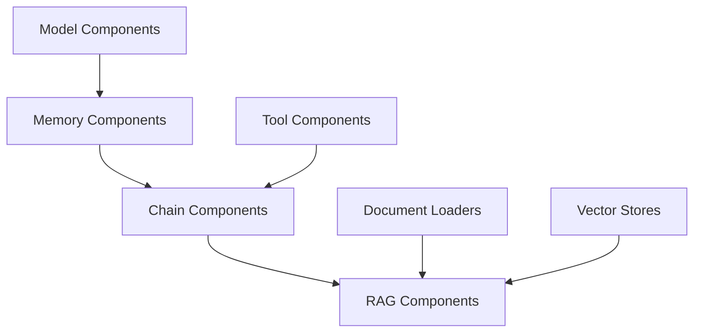

# Plano de Implementação - Componentes LangChain4j

## Fase 1: Componentes Core

### 1.1 Model Components (archflow-plugin-langchain/models)
```java
@ComponentDescriptor(
    id = "openai-chat-model",
    type = ComponentType.TOOL,
    properties = {
        @Property(id = "apiKey", required = true),
        @Property(id = "model", defaultValue = "gpt-3.5-turbo"),
        @Property(id = "temperature", type = "number", defaultValue = "0.7"),
        @Property(id = "maxTokens", type = "number", defaultValue = "2000")
    }
)
public class OpenAIChatModelComponent implements Tool {
    // Implementação usando OpenAiChatModel
}

// Componentes Similares:
- AnthropicChatModelComponent
- HuggingFaceChatModelComponent
```

Prioridade: ALTA
Objetivo: Fornecer acesso aos modelos de linguagem básicos

### 1.2 Memory Components (archflow-plugin-langchain/memory)
```java
@ComponentDescriptor(
    id = "message-window-memory",
    type = ComponentType.TOOL,
    properties = {
        @Property(id = "maxMessages", type = "number", defaultValue = "10")
    }
)
public class MessageWindowMemoryComponent implements Tool {
    // Implementação usando MessageWindowChatMemory
}

// Componentes Similares:
- TokenWindowMemoryComponent
- BufferedMemoryComponent
```

Prioridade: ALTA
Objetivo: Gerenciamento de memória para conversas

### 1.3 Chain Components (archflow-plugin-langchain/chains)
```java
@ComponentDescriptor(
    id = "conversational-openai",
    type = ComponentType.CHAIN,
    properties = {
        @Property(id = "model", required = true),
        @Property(id = "memory", required = true)
    }
)
public class ConversationalChainComponent implements Tool {
    // Implementação usando ConversationalChain
}

// Componentes Similares:
- SequentialChainComponent
- PromptTemplateComponent
```

Prioridade: ALTA
Objetivo: Implementar chains básicas do LangChain4j

## Fase 2: Tools Básicas

### 2.1 Calculation Tools
```java
@ComponentDescriptor(
    id = "calculator-tool",
    type = ComponentType.TOOL
)
public class CalculatorToolComponent implements Tool {
    // Implementação usando CalculatorTool
}
```

Prioridade: MÉDIA
Objetivo: Ferramenta básica de cálculo

### 2.2 Web Search Tools
```java
@ComponentDescriptor(
    id = "web-search-tool",
    type = ComponentType.TOOL,
    properties = {
        @Property(id = "provider", defaultValue = "duckduckgo"),
        @Property(id = "apiKey")
    }
)
public class WebSearchToolComponent implements Tool {
    // Implementação usando WebSearchTool
}
```

Prioridade: MÉDIA
Objetivo: Capacidade de busca na web

## Fase 3: RAG Components

### 3.1 Document Loaders
```java
@ComponentDescriptor(
    id = "file-system-loader",
    type = ComponentType.TOOL,
    properties = {
        @Property(id = "path", required = true)
    }
)
public class FileSystemLoaderComponent implements Tool {
    // Implementação usando FileSystemDocumentLoader
}

// Componentes Similares:
- PdfLoaderComponent
- TextLoaderComponent
```

Prioridade: MÉDIA-ALTA
Objetivo: Carregamento de documentos

### 3.2 Vector Stores
```java
@ComponentDescriptor(
    id = "chroma-store",
    type = ComponentType.TOOL,
    properties = {
        @Property(id = "collection", required = true)
    }
)
public class ChromaStoreComponent implements Tool {
    // Implementação usando ChromaEmbeddingStore
}

// Componentes Similares:
- ElasticsearchStoreComponent
- RedisStoreComponent
```

Prioridade: MÉDIA-ALTA
Objetivo: Armazenamento de embeddings

### 3.3 RAG Chains
```java
@ComponentDescriptor(
    id = "rag-openai",
    type = ComponentType.CHAIN,
    properties = {
        @Property(id = "model", required = true),
        @Property(id = "store", required = true),
        @Property(id = "embeddings", required = true)
    }
)
public class RAGChainComponent implements Tool {
    // Implementação usando RetrievalAugmentedChain
}
```

Prioridade: MÉDIA-ALTA
Objetivo: Chains de RAG completas

## Sequência de Implementação

1. **Sprint 1 - Core Models**
   - OpenAIChatModelComponent
   - AnthropicChatModelComponent
   - Testes e documentação

2. **Sprint 2 - Memory & Basic Chains**
   - MessageWindowMemoryComponent
   - ConversationalChainComponent
   - Testes e documentação

3. **Sprint 3 - Basic Tools**
   - CalculatorToolComponent
   - WebSearchToolComponent
   - Testes e documentação

4. **Sprint 4 - Document Processing**
   - FileSystemLoaderComponent
   - PdfLoaderComponent
   - Testes e documentação

5. **Sprint 5 - Vector Stores**
   - ChromaStoreComponent
   - ElasticsearchStoreComponent
   - Testes e documentação

6. **Sprint 6 - RAG Integration**
   - RAGChainComponent
   - Testes e documentação

## Padrões de Implementação

### 1. Estrutura do Componente
```java
public class BaseComponent implements Tool {
    private final LangChainAdapter adapter;
    
    @Override
    public void initialize(Map<String, Object> config) {
        adapter.configure(config);
    }
    
    @Override
    public Result execute(Map<String, Object> params, ExecutionContext context) {
        return adapter.execute("operation", params, context);
    }
}
```

### 2. Testes
- Testes unitários
- Testes de integração
- Testes de configuração
- Mock de LLMs

### 3. Documentação
- README por componente
- Exemplos de uso
- Guias de configuração
- Samples de fluxos

## Dependências entre Componentes



## Próximos Passos

1. **Preparação**
   - Setup da estrutura Maven
   - Templates de componentes
   - CI/CD pipeline

2. **Desenvolvimento**
   - Implementar por sprint
   - Code reviews
   - Testes automatizados

3. **Documentação**
   - Atualizar guias
   - Criar exemplos
   - Documentar APIs

4. **Validação**
   - Testes de integração
   - Validação de fluxos
   - Feedback da comunidade