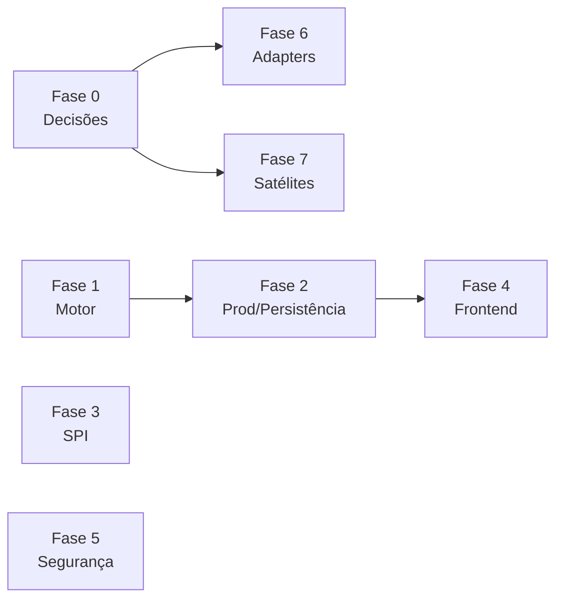

# Plano de Homologação — archflow

> Origem: auditoria completa de 2026-07-20 (5 frentes: núcleo de execução, API/prod-readiness,
> plugins/adapters LangChain4j, frontend, módulos satélites). Build compila e a suíte passa,
> mas os gaps são de fiação de runtime que os testes atuais contornam.
>
> Severidades: **[B]** bloqueador · **[A]** alto · **[M]** médio.
> Tamanhos: **S** (< ½ dia) · **M** (½–2 dias) · **L** (> 2 dias), estimativas grosseiras.

## Critério de saída (Definition of Done da homologação)

1. `SPRING_PROFILES_ACTIVE=prod` sobe com Postgres via docker-compose, sem `archflow.allow-in-memory`.
2. Fluxo ramificado criado no designer (A→B/C com condição + error path) executa corretamente;
   cancel interrompe a execução de fato; resume não reexecuta steps concluídos.
3. Restart do backend não perde workflows, execuções nem estado de fluxos.
4. Auth ligada; admin loga e acessa a área admin; nenhum endpoint retorna dado mockado.
5. Catálogo de plugins e galeria de templates populados.
6. SPA buildável e servível como artefato estático.

---

## Fase 0 — Decisões de escopo — **DECIDIDO em 2026-07-20**

- [x] **0.1** Matriz de LLM providers: **corrigir todos os 15+** (decisão do time). A Fase 6.1 passa a
      cobrir a reimplementação de Gemini, Bedrock, Watsonx, Vertex, Cohere, HuggingFace, Qianfan e
      Hunyuan além dos 8 estáveis. Nota: validação real de cada provider exige credenciais de teste —
      sem elas, a correção fica limitada a "correto por construção" (classes/builders/endpoints certos).
- [x] **0.2** Satélites sem fiação (observability, performance/cache, brainsentry, marketplace,
      guardrails): **despublicar de UI/docs até integrar**, integração posterior por demanda.
      A auditoria admin (5.5/5.6) permanece no escopo da Fase 5.
- [x] **0.3** Stack: **manter Spring Boot 4 e alinhar docs** — atualizar para o patch 4.0.x mais
      recente, corrigir CLAUDE.md/readme (Boot 3.3/Java 17 → real), Dockerfile e a propriedade
      legada de static-locations (item 2.7).
- [x] **0.4** Chat de conversas: **implementar já** o pipeline completo (mensagem → agente → resposta
      via SSE). Item 4.3 vira implementação (esforço L). Dependência técnica: o pipeline usa o motor
      e a persistência — sequenciar após o mínimo viável das Fases 1–2 continua sendo o caminho de
      menor retrabalho, mas a feature está DENTRO do escopo de homologação.

## Fase 1 — Motor de execução (P0 — nada funciona de verdade sem isso)

Módulos: `archflow-agent`, `archflow-core`, `archflow-model`.

- [ ] **1.1** [B] Corrigir `findNextSteps`/`findErrorSteps` (`DefaultFlowExecutor.java:222-236`):
      hoje resolvem o **próprio step de origem** (sourceId default = próprio stepId no
      `DefaultFlowStepFactory.java:92`) → recursão infinita em qualquer fluxo com conexões.
      Devem resolver os steps **alvo** (`targetId`) das conexões de saída. — **M**
- [ ] **1.2** [B] `DefaultFlowExecutor.execute()` (linha 67) executa `flow.getSteps()` inteiro em
      ordem de lista. Trocar por: identificar steps-raiz do grafo e propagar pelas conexões
      (sem dupla execução quando 1.1 entrar). — **M**
- [ ] **1.3** [B] Avaliar `StepConnection.getCondition()` na travessia (hoje nunca é lida no runtime).
      Definir a linguagem de expressão (SpEL/JEXL/formato do designer) e aplicá-la em next/error paths. — **M/L**
- [ ] **1.4** [B] Cancelamento/pause cooperativo real: passar `ExecutionControl` ao executor e checar
      `isPaused()/isStopped()` entre steps (hoje as flags de `DefaultExecutionManager.java:96-112`
      não são lidas por ninguém — cancel é cosmético). — **M**
- [ ] **1.5** [B] Human-in-the-loop real: `requestApproval` deve suspender a execução e `submitApproval`
      retomá-la; armazenar e validar o `requestId` (hoje a thread segue executando e o requestId é
      descartado — `DefaultFlowEngine.java:386-453`). — **L**
- [x] **1.6** [A] `findScopedKey` (`DefaultFlowExecutor.java:174-180`) casa por sufixo `:stepId` e cruza
      resultados entre fluxos concorrentes com IDs de step iguais. Match exato `flowId:stepId`. — **S**
      *(feito 2026-07-20: dispatch interno usa a chave exata; caminho público falha alto se ambíguo)*
- [ ] **1.7** [A] Persistir estado no caminho feliz e em falha de step com checkpoint por step
      (`currentStepId`). Hoje `saveState` só ocorre em pause/cancel/approval, e
      `DefaultExecutionManager.java:59-92` engole exceções devolvendo FAILED sem persistir —
      `getFlowStatus` pós-execução lança `FlowNotFoundException` e a tabela `flow_states` fica vazia. — **M**
- [x] **1.8** [A] Corrigir assimetria de tenant: save grava sob `state.getTenantId()`, load lê fixo sob
      `"SYSTEM"` (`JdbcStateRepository.java:37-45`, `InMemoryStateRepository.java:34-42`) —
      resume/status quebrados para qualquer tenant real. — **S**
      *(feito 2026-07-20: `getState(flowId)` resolve por flowId em qualquer tenant nos dois repositórios)*
- [ ] **1.9** [A] Resume incremental: usar o checkpoint (1.7) para pular steps concluídos
      (hoje `resumeFlow` reexecuta o fluxo inteiro → efeitos colaterais duplicados). — **M**
- [ ] **1.10** [A] Retry real no executor honrando `AgentConfig.retryConfig`/`RetryPolicy`
      (aceitos e nunca aplicados; o único retry existente é o do `FuncAgentExecutor`). — **M**
- [ ] **1.11** [M] Timeout de fluxo deve cancelar a execução e liberar permit do `flowSemaphore` +
      `activeExecutions` (`DefaultFlowEngine.java:310` — hoje `orTimeout` vaza a thread e o permit). — **M**
- [ ] **1.12** [M] Métricas atômicas: `DefaultExecutionContext.addStepMetrics` (linhas 157-164) faz
      `+=` não-atômico em contexto compartilhado por steps paralelos. — **S**
- [ ] **1.13** [M] `JdbcStateRepository`: round-trip completo do `FlowState` (hoje `mapRowToFlowState`
      descarta metrics/error/executionPaths; `toJson` engole erro de serialização gravando null). — **S**
- [ ] **1.14** [M] Completar as 5 validações vazias do `DefaultFlowValidator.java:212-230`
      (chain/agent/tool config, connections, condition). — **M**
- [ ] **1.15** [B] Testes E2E de grafo cobrindo o que as fixtures atuais evitam: fluxos **com conexões**,
      branching condicional, error path, cancel no meio, pause/resume, retry. Sem isso as regressões
      de 1.1–1.10 voltam. — **L**

## Fase 2 — Boot de produção e persistência da API

Módulos: `archflow-api`, `archflow-standalone`, deploy.

- [x] **2.1** [B] `WebSocketConfiguration.java:30` exige `SpringRealtimeController`, que só existe com o
      `DevRealtimeAdapter` (perfil dev) → prod não sobe. Tornar opcional
      (`ObjectProvider`/`@ConditionalOnBean`). — **S**
      *(feito 2026-07-20: ObjectProvider; sem RealtimeAdapter o endpoint WS só não é registrado)*
- [ ] **2.2** [B] Implementar `JdbcFlowRepository` (com `FlowJsonCodec`) e ligá-lo no
      `JdbcPersistenceConfiguration` — hoje `flowRepository()` é sempre `InMemoryFlowRepository`
      e o `ProductionReadinessGuard` barra o boot por isso. — **M**
- [ ] **2.3** [B] Implementar fila durável `JdbcAgentInvocationQueue` (não existe nenhuma implementação
      durável; segundo motivo de veto do guard). — **M**
- [ ] **2.4** [B] Persistir CRUD de workflows e histórico de execuções no banco: substituir os
      `ConcurrentHashMap` de `SpringWorkflowCrudController` e `InMemoryWorkflowRuntimeStore` por
      repositórios JDBC usando o schema Flyway já existente (`V1_2__create_flows.sql`). — **L**
- [ ] **2.5** [M] Persistir config admin (catálogo de modelos, toggles, plan defaults — hoje in-memory
      em `GlobalConfigControllerImpl:32-46`, revertem no restart). — **M**
- [ ] **2.6** [A] docker-compose de homologação subindo com perfil `prod` + Postgres + smoke test de
      boot (o compose atual usa `dev` e não exercita a persistência durável). — **M**
- [ ] **2.7** [M] Dockerfile: `--spring.resources.static-locations` é propriedade legada (Boot 3+/4 usa
      `spring.web.resources.static-locations`); alinhar versão de Java à decisão 0.3. — **S**
- [ ] **2.8** [M] Estender `ProdBootReadinessBoundaryTest` para asserir o boot completo do contexto prod
      (hoje ele documenta a falha; deve passar a documentar o sucesso). — **S**

## Fase 3 — Catálogos SPI (barato, destrava duas features inteiras)

- [x] **3.1** [B] Criar `META-INF/services/br.com.archflow.plugin.api.spi.ComponentPlugin` nos 3 módulos
      de plugins (agents/assistants/tools) — hoje **nenhum existe** e o catálogo carrega vazio em
      silêncio. Adicionar teste que falha se o catálogo vier vazio. — **S**
      *(feito 2026-07-20: 3 arquivos SPI + ComponentPluginSpiRegistrationTest por módulo)*
- [x] **3.2** [B] Registrar os 4 templates built-in (`META-INF/services/...WorkflowTemplate` ou registro
      programático no boot) — `/api/templates` e a galeria da UI retornam vazio sempre. Teste idem. — **S**
      *(feito 2026-07-20: arquivo SPI + TemplateSpiRegistrationTest; registry ganhou `clear()` para testes unitários)*
- [ ] **3.3** [M] `POST /api/templates/{id}/install` deve persistir o workflow gerado no repositório
      (hoje só devolve o JSON — "instalar" não cria nada executável). — **S**
- [ ] **3.4** [A] Plugin loader: a "resolução de dependências via Jeka" anunciada não existe (zero
      referências no código). Decidir: implementar ou corrigir docs exigindo fat-jars. Documentar a
      fronteira de confiança (fallback total ao classloader pai + `onLoad` sem sandbox = só jars
      confiáveis). — **S** (docs) / **L** (implementar)

## Fase 4 — Frontend (`archflow-ui`)

- [x] **4.1** [B] Gravar o papel do usuário no login: nada escreve `sessionStorage['archflow_role']`
      que o `useTenantStore.ts:53` lê — todo usuário vira `viewer` e a área admin fica inacessível.
      Fazer a ponte auth-store (`roles`) → tenant store. — **S**
      *(feito 2026-07-20: loadUser mapeia ADMIN→superadmin, DESIGNER/EXECUTOR→editor, VIEWER→viewer; setRole persiste; logout limpa)*
- [ ] **4.2** [B] Build de produção do SPA: `vite.config.ts` só builda a lib do web-component; não
      existe artefato deployável do app. Configurar build duplo (app + lib). — **M**
- [ ] **4.3** [B] Chat de conversas (conforme 0.4): o front conecta em `GET /api/stream/{tenant}/{session}`
      que **não existe** no backend, e `POST /conversations/{id}/messages` só persiste sem disparar
      agente → spinner eterno. Implementar endpoint SSE + pipeline de resposta, ou ocultar a tela. — **L** / **S**
- [ ] **4.4** [M] Não há caminho na UI para **criar** conversa (lista só navega). — **S**
- [ ] **4.5** [A] Com auth ligada: `HttpAgent` do CopilotKit chama `/ag-ui/agent` sem `Authorization`
      (`AppLayout.tsx:87`) e o WebSocket de voz usa `/api/realtime/...` fora dos `publicPaths`
      (`JwtAuthenticationFilter.java:147-155`) → 401 em Copilot, "Gerar com IA" e voz.
      Enviar token e/ou corrigir a autenticação desses canais. — **M**
- [ ] **4.6** [M] Ciclo de vida de workflow: backend fixa `status: "draft"` e não há ação de ativação —
      card "Ativos" do dashboard eternamente 0. Implementar draft→active (back + front). — **M**
- [ ] **4.7** [M] `ApprovalDetailPage.tsx:39` usa o objeto `TenantInfo` inteiro como tenantId
      (`[object Object]`); `agent-playground-api.ts:44` depende de normalização de `/../` no path. — **S**
- [ ] **4.8** [M] `LiveEventsPage` (`/admin/observability/live`) usa o mesmo stream inexistente do 4.3 —
      resolver junto. — **S**

## Fase 5 — Segurança

- [ ] **5.1** [A] Auth JWT vem **desligada por default** (`JwtAuthenticationFilter.java:79`) e o compose
      sobe em dev → API aberta. Ligar por default fora de dev/test, ou fazer o readiness guard
      falhar quando off. — **S**
- [ ] **5.2** [A] `JwtService.java:52-59`: recusar boot com segredo ausente/curto em vez de padear com
      zeros; remover o default público do `application.yml`. — **S**
- [ ] **5.3** [A] API keys: trocar SHA-256 puro sem salt (`ApiKeyService.java:151-157`, "for demo") por
      BCrypt/Argon2 + comparação constant-time; migrar chaves existentes. — **M**
- [ ] **5.4** [A] Enforcement de superadmin no `GlobalConfigController` (o Javadoc exige, o código não
      tem): ligar o `PermissionAspect`/`@RequiresPermission` do archflow-security — hoje o aspecto
      não é aplicado em nenhum controller. — **M**
- [ ] **5.5** [A] Remover os dados mockados hardcoded de `getAuditLog`/`getUsageByTenant`/`exportUsageCsv`
      (`GlobalConfigControllerImpl.java:88-123` — "Acme Corp", "Demo Trial"): ligar ao
      `JdbcAuditRepository` e a agregação real de uso. — **M**
- [ ] **5.6** [A] Instrumentar produtores de `AuditEvent`: o `JdbcAuditRepository` existe mas **nenhum
      código grava evento** — a trilha de auditoria fica eternamente vazia. Cobrir operações
      críticas (login, CRUD de workflow, execução, config admin, API keys). — **M**
- [ ] **5.7** [M] CORS: default de prod utilizável (env documentada), restringir
      `setAllowedOriginPatterns("*")` do WS (`WebSocketConfiguration.java:37`), e remover ou ligar a
      `CorsConfiguration` morta do archflow-security. — **S**
- [ ] **5.8** [M] `ImpersonationFilter.java:100-107`: "sem roles = pode impersonar" — inverter para negar. — **S**
- [x] **5.9** [A] `LLMProviderHub.java:277`: streaming DeepSeek/Mistral sem baseUrl default cai no
      endpoint da OpenAI, **enviando a API key ao provedor errado**. Aplicar os mesmos defaults do
      caminho não-streaming (linhas 440/468). — **S**
      *(feito 2026-07-20: defaults api.deepseek.com / api.mistral.ai/v1 aplicados no caminho streaming)*

## Fase 6 — Adapters LangChain4j

- [ ] **6.1** [A] Provider Hub conforme 0.1: corrigir reflexão de Gemini
      (`GoogleAiGeminiChatModel`), Bedrock (classe + modelId/região/credenciais), Watsonx, Vertex;
      remover os falsos "OpenAI-compatible"; alinhar `LLMProvider.supportsStreaming` com o que
      `createStreamingModel` implementa; propagar a causa real nos erros de reflexão. — **L**
- [ ] **6.2** [B] `RagChainAdapter.java:160` exige `ChatModel`, que nenhum chat adapter implementa —
      RAG inutilizável para 100% das combinações. Expor o `ChatModel` interno dos adapters
      (ex.: interface `ChatModelProvider`) ou construir a partir do config. — **M**
- [ ] **6.3** [A] Vector stores: Redis ignora `request.filter()` silenciosamente (vazamento entre
      tenants/coleções) e retorna o embedding da query como embedding do match; pgvector não persiste
      metadados mas gera `WHERE chave = valor` tratando chave como coluna (SQLException sempre);
      Pinecone só persiste `text`. Implementar filtros reais (JSONB no pgvector; RediSearch ou filtro
      pós-busca no Redis) e migrar `KEYS`→`SCAN`. — **L**
- [ ] **6.4** [A] MCP stdio (`StdioClientTransport`): consumir stderr do subprocesso (deadlock com
      ~64KB de log), timeout em `sendRequest`, completar exceptionalmente os `pendingRequests` em
      EOF/morte do processo (hoje `.get()` pendura para sempre). — **M**
- [ ] **6.5** [M] Memória Redis/JDBC rejeita `SystemMessage`/`ToolExecutionResultMessage`
      (`RedisMemoryAdapter.serializeMessage:139`, `JdbcMemoryAdapter:88`) — histórico agentic com
      tools quebra no persist. — **S**
- [ ] **6.6** [M] Pinecone: `remove` usa `DELETE ?id=` em vez de `POST /vectors/delete` com body
      `{"ids":[...]}`; cast `(Double) score` quebra com score inteiro. — **S**
- [ ] **6.7** [M] Chat adapters serializam toda chamada HTTP sob `ReentrantLock` (ex.:
      `OpenAiChatAdapter.execute:148`) — paralelismo vira fila. Restringir o lock à
      configuração, não à chamada. — **S**
- [ ] **6.8** [M] Limpar duplicatas mortas: `OpenAiAdapterFactory` (não registrada) vs
      `OpenAiChatAdapterFactory`; `package-info` do chain-rag copiado no módulo anthropic. — **S**
- [ ] **6.9** [M] `LLMProviderHub.withProvider` (linhas 640-664) muta config global sem sincronização
      — chamadas concorrentes usam provider errado. — **S**

## Fase 7 — Satélites: integrar ou despublicar (conforme 0.2)

- [ ] **7.1** [A] Observability: nada emite métrica/span pelas classes do módulo e o archflow-api nem
      tem actuator/micrometer no pom. Integrar (instrumentar engine/api, expor Prometheus) ou remover
      a promessa "OTel/Prometheus/Grafana/Jaeger" do readme. — **L** / **S**
- [ ] **7.2** [A] Brainsentry: módulo fora do classpath do api; a UI de config grava em memória algo que
      nada consome. Integrar (dependência + wiring do interceptor + docker do serviço externo) ou
      retirar UI/docs. — **L** / **S**
- [ ] **7.3** [A] Performance/cache: módulo órfão (nenhum pom depende dele). Integrar os interceptors de
      cache LLM/embedding ou retirar das docs. Se integrar: trocar a serialização Java nativa do
      `RedisCacheManager` (vetor de desserialização insegura). — **M** / **S**
- [ ] **7.4** [A] Marketplace: "instalar" só registra manifest em memória (em `/tmp`), não carrega
      código, e as `trustedKeys` RSA nunca são configuradas (verificação de assinatura reduzida a
      checksum). Ponte com o plugin-loader + persistência + trustedKeys, ou rebaixar a "catálogo"
      nas docs. — **L** / **S**
- [ ] **7.5** [M] Examples: `examples/spring-boot` não compila (importa API imaginária,
      `archflow-spring-boot-starter` não existe) — corrigir ou remover; react/vue dependem de pacote
      npm não publicado e chamam endpoints inexistentes. — **M**
- [ ] **7.6** [A] Docs vs realidade: atualizar readme/CLAUDE.md (Jeka, observability, brainsentry,
      marketplace, templates, caching, tabela de examples, stack Java/Boot) para o estado real —
      em homologação, feature anunciada e inexistente é bug. — **S**
- [ ] **7.7** [M] Guardrails/governança/summarizer do archflow-conversation: integrar ao caminho de
      execução do servidor ou documentar explicitamente como biblioteca opt-in. — **M**

## Fase 8 — Residuais

- [ ] **8.1** [M] `WorkflowToolRegistry.createComposite/createParallel` ignoram a lista de tools e criam
      tool sem executor (qualquer `execute()` lança `IllegalStateException`); `timeout`/`async`/
      `maxRetries` do builder nunca aplicados. Implementar ou remover a API. — **M**
- [ ] **8.2** [M] Plugins "AI" pré-construídos usam regex, não LLM (`ConversationalAgent:383-421` etc.).
      Ligar ao provider hub ou documentar como demo heurística. — **M**
- [ ] **8.3** [S] Dependência morta `archflow-workflow-tool` → `archflow-templates`. — **S**

---

## Sequenciamento

- **Trilhas paralelizáveis**: Fase 1 (motor), Fase 3 (SPI — ganho rápido), Fase 5 (segurança) e
  Fase 0 podem começar juntas; Fase 2 depende de 1.7/1.8 para o estado fazer sentido; Fase 4
  depende de 2.4 (persistência) e 0.4 (chat).
- **Ganhos rápidos da primeira semana**: 3.1, 3.2, 4.1, 5.9, 2.1, 1.6, 1.8 — todos S, cada um
  destrava uma feature visível ou fecha um risco de segurança.
- **Caminho crítico**: Fase 1 (1.1→1.2→1.3→1.4→1.7→1.15) — é o coração do produto e o maior L do plano.
