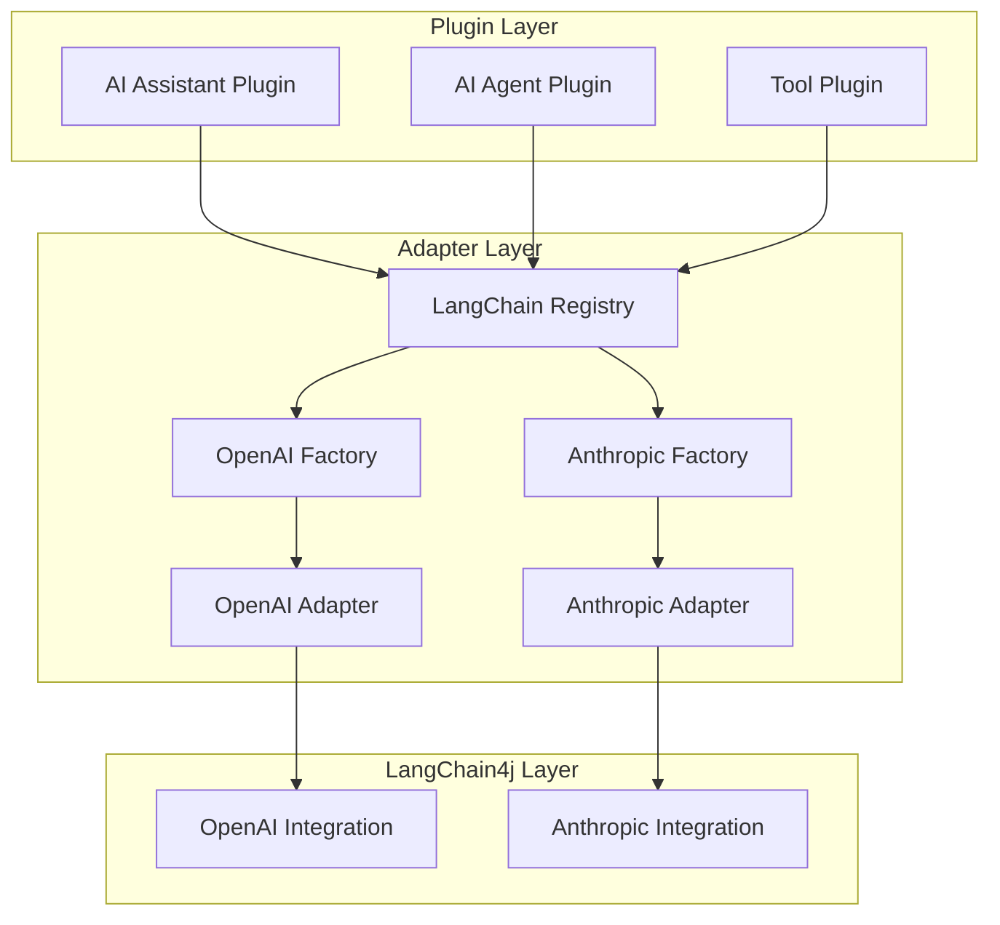

# Archflow LangChain4j Adapters

## Visão Geral

O archflow é um framework lowcode para criação de fluxos de IA usando LangChain4j. Para manter a flexibilidade e extensibilidade do framework, implementamos um sistema de adapters que segue princípios similares ao Apache Camel.

### Conceitos Chave

1. **Adapters**: Camada de integração com LangChain4j
   - Não são plugins
   - Uso interno pelos plugins
   - Descobertos via SPI em runtime

2. **Plugins**: Componentes de IA do archflow
   - Implementam `AIComponent`, `AIAssistant`, `AIAgent` ou `Tool`
   - Usam adapters internamente
   - Declaram providers suportados via metadados

3. **Providers**: Implementações específicas
   - OpenAI, Anthropic, etc
   - Cada um em seu próprio módulo
   - Carregados sob demanda

## Arquitetura



### Estrutura de Módulos

```
archflow-langchain4j/
├── archflow-langchain4j-core/         # Interfaces base
├── archflow-langchain4j-openai/       # Adapter OpenAI
├── archflow-langchain4j-anthropic/    # Adapter Anthropic
├── archflow-langchain4j-memory-redis/ # Adapter Redis Memory
└── ...
```

## Implementação

### 1. Interface Base do Adapter

```java
public interface LangChainAdapter {
    void configure(Map<String, Object> properties);
    Object execute(String operation, Object input, ExecutionContext context) throws Exception;
    void shutdown();
}
```

### 2. SPI para Factories

```java
public interface LangChainAdapterFactory {
    String getProvider();
    LangChainAdapter createAdapter(Map<String, Object> properties);
    boolean supports(String type);
}
```

### 3. Registry Central

```java
public class LangChainRegistry {
    private static final Map<String, LangChainAdapterFactory> factories = new ConcurrentHashMap<>();
    
    static {
        // Carrega factories via SPI
        ServiceLoader<LangChainAdapterFactory> loader = 
            ServiceLoader.load(LangChainAdapterFactory.class);
        for (LangChainAdapterFactory factory : loader) {
            factories.put(factory.getProvider(), factory);
        }
    }
    
    public static LangChainAdapter createAdapter(
            String provider, 
            String type, 
            Map<String, Object> properties) {
        // ...
    }
}
```

### 4. Implementação de Provider

```java
public class OpenAiAdapterFactory implements LangChainAdapterFactory {
    @Override
    public String getProvider() {
        return "openai";
    }
    
    @Override
    public LangChainAdapter createAdapter(Map<String, Object> properties) {
        return new OpenAiModelAdapter(properties);
    }
    
    @Override
    public boolean supports(String type) {
        return "model".equals(type) || "chat".equals(type);
    }
}
```

### 5. Uso em Plugin

```java
@ComponentDescriptor(
    id = "example-assistant",
    name = "Example Assistant",
    type = ComponentType.ASSISTANT,
    version = "1.0.0",
    properties = {
        @Property(
            id = "model.provider", 
            name = "Provedor do Modelo",
            type = "enum",
            allowedValues = {"openai", "anthropic"}
        )
    }
)
public class ExampleAssistant implements AIAssistant, ComponentPlugin {
    private LangChainAdapter modelAdapter;
    
    @Override
    public void initialize(Map<String, Object> config) {
        String provider = (String) config.get("model.provider");
        String type = (String) config.get("model.type");
        
        this.modelAdapter = LangChainRegistry.createAdapter(
            provider, type, config);
    }
    
    // ...
}
```

## Guia de Desenvolvimento

### Criando um Novo Provider

1. Crie um novo módulo:
```xml
<artifactId>archflow-langchain4j-newprovider</artifactId>
<dependencies>
    <dependency>
        <groupId>br.com.archflow</groupId>
        <artifactId>archflow-langchain4j-core</artifactId>
    </dependency>
    <dependency>
        <groupId>dev.langchain4j</groupId>
        <artifactId>langchain4j-newprovider</artifactId>
    </dependency>
</dependencies>
```

2. Implemente o Factory:
```java
public class NewProviderFactory implements LangChainAdapterFactory {
    @Override
    public String getProvider() {
        return "newprovider";
    }
    // ...
}
```

3. Crie o arquivo SPI:
```
META-INF/services/br.com.archflow.langchain4j.spi.LangChainAdapterFactory
br.com.archflow.langchain4j.newprovider.NewProviderFactory
```

### Criando um Plugin que Usa Adapters

1. Declare providers suportados nos metadados
2. Use o registry para criar adapters
3. Não referencie adapters específicos diretamente
4. Valide configurações antes de criar adapter

### Boas Práticas

1. **Isolamento de Dependências**
   - Cada provider em seu próprio módulo
   - Dependências específicas isoladas
   - Evite dependências transitivas desnecessárias

2. **Validação de Configuração**
   - Valide todas as propriedades necessárias
   - Forneça mensagens de erro claras
   - Documente propriedades suportadas

3. **Tratamento de Erros**
   - Use exceções específicas
   - Forneça contexto nos erros
   - Considere retry/fallback quando apropriado

4. **Métricas e Monitoramento**
   - Registre métricas relevantes
   - Monitore uso de recursos
   - Trace operações importantes

## Exemplos de Uso

### Exemplo 1: Plugin de Suporte Técnico

```java
@ComponentDescriptor(
    id = "tech-support",
    name = "Technical Support Assistant",
    type = ComponentType.ASSISTANT,
    properties = {
        @Property(
            id = "model.provider", 
            allowedValues = {"openai", "anthropic"}
        ),
        @Property(
            id = "model.type",
            allowedValues = {"chat"}
        )
    }
)
public class TechSupportAssistant implements AIAssistant, ComponentPlugin {
    private LangChainAdapter chatAdapter;
    
    @Override
    public void initialize(Map<String, Object> config) {
        chatAdapter = LangChainRegistry.createAdapter(
            config.get("model.provider"),
            "chat",
            config
        );
    }
    
    @Override
    public Response generateResponse(Analysis analysis, ExecutionContext ctx) {
        return chatAdapter.execute("chat", analysis.getPrompt(), ctx);
    }
}
```

### Exemplo 2: Plugin de Análise de Documentos

```java
@ComponentDescriptor(
    id = "doc-analyzer",
    name = "Document Analyzer",
    type = ComponentType.TOOL,
    properties = {
        @Property(
            id = "embedding.provider", 
            allowedValues = {"openai", "huggingface"}
        )
    }
)
public class DocAnalyzer implements Tool, ComponentPlugin {
    private LangChainAdapter embeddingAdapter;
    
    @Override
    public void initialize(Map<String, Object> config) {
        embeddingAdapter = LangChainRegistry.createAdapter(
            config.get("embedding.provider"),
            "embedding",
            config
        );
    }
    
    @Override
    public Result execute(Map<String, Object> params, ExecutionContext ctx) {
        return embeddingAdapter.execute("embed", params.get("text"), ctx);
    }
}
```

## Conclusão

Esta arquitetura de adapters permite:

1. **Extensibilidade**
   - Novos providers podem ser adicionados facilmente
   - Plugins podem usar múltiplos providers
   - Carregamento dinâmico de funcionalidades

2. **Desacoplamento**
   - Plugins independentes de implementações específicas
   - Providers podem evoluir separadamente
   - Dependências gerenciadas eficientemente

3. **Manutenibilidade**
   - Código organizado e modular
   - Fácil de testar e debugar
   - Documentação clara de responsabilidades

4. **Flexibilidade**
   - Usuários podem escolher providers
   - Plugins podem definir suporte específico
   - Configuração via metadados
