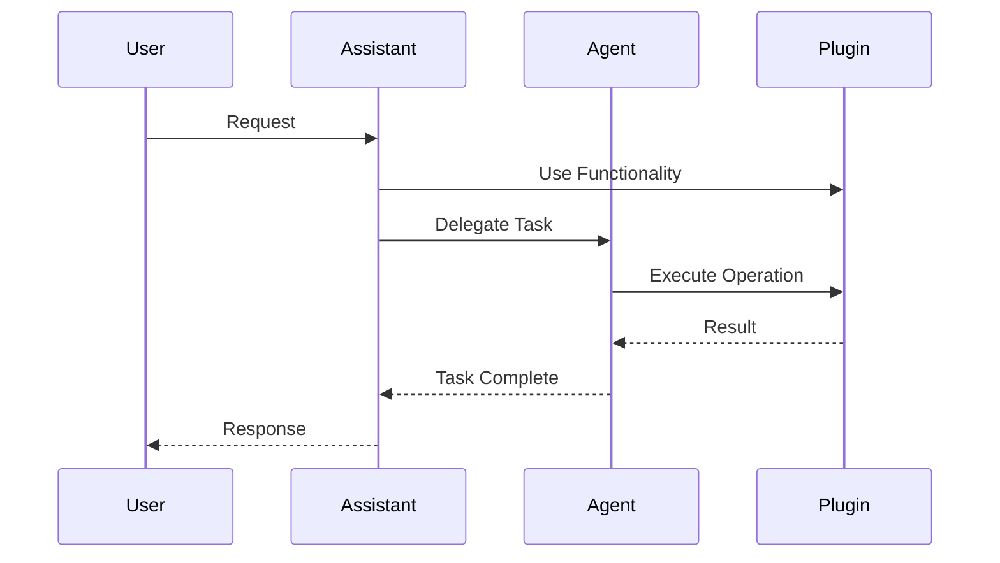

# Componentes de IA no archflow

O archflow fornece uma estrutura hierárquica clara para diferentes tipos de componentes de IA, cada um com seu propósito e capacidades específicas.

## Hierarquia de Componentes

### 1. AIComponent (Interface Base)
A interface base para todos os componentes de IA no archflow, definindo o contrato fundamental:
```java
public interface AIComponent {
    void initialize(Map<String, Object> config);
    ComponentMetadata getMetadata();
    List<String> getCapabilities();
    void shutdown();
}
```

### 2. AIAssistant (Assistentes Especializados)
Assistentes são componentes especializados em tarefas específicas, com foco em interação e resposta:
```java
public interface AIAssistant extends AIComponent {
    Analysis analyzeRequest(String input);
    Response generateResponse(Context context);
    void useTools(List<Tool> tools);
    String getSpecialization();
}
```

Exemplos de Assistentes:
- Copilot de Vendas
- Assistente de Suporte Técnico
- Assistente de Marketing
- Assistente de RH

### 3. AIAgent (Agentes Autônomos)
Agentes são componentes mais autônomos, capazes de tomar decisões e executar ações:
```java
public interface AIAgent extends AIComponent {
    Result executeTask(Task task);
    Decision makeDecision(Context context);
    List<Action> planActions(Goal goal);
    void learnFromFeedback(Feedback feedback);
}
```

Características dos Agentes:
- Autonomia na tomada de decisões
- Capacidade de planejamento
- Aprendizado com feedback
- Uso de ferramentas disponíveis

### 4. AIPlugin (Plugins Reutilizáveis)
Plugins são componentes base que fornecem funcionalidades específicas:
```java
public interface AIPlugin extends AIComponent {
    Result execute(String operation, Object input);
    List<Operation> getOperations();
    void validateConfig(Map<String, Object> config);
    Status getStatus();
}
```

Tipos comuns de Plugins:
- Conectores de CRM/ERP
- Processadores de Documentos
- Analisadores de Sentimento
- Integrações com APIs

### 5. Tool (Ferramentas)
Ferramentas são capacidades específicas que podem ser usadas por Assistentes e Agentes:
```java
public interface Tool extends AIComponent {
    Result execute(Map<String, Object> params);
    String getDescription();
    List<Parameter> getParameters();
}
```

## Composição e Uso

### Assistentes usando Plugins
```java
@AIAssistant(name = "SalesCopilot")
public class SalesCopilotAssistant implements AIAssistant {
    @Inject
    private CRMPlugin crmPlugin;
    
    @Inject
    private QuotationPlugin quotationPlugin;
    
    public Response generateQuotation(String customerRequest) {
        // Usa plugins para gerar cotação
    }
}
```

### Agentes usando Ferramentas
```java
@AIAgent(name = "SalesAgent")
public class AutonomousSalesAgent implements AIAgent {
    @Inject
    private List<Tool> tools;
    
    public void executeTask(Task task) {
        // Usa ferramentas para executar tarefa
    }
}
```

## Fluxo de Execução



## Principais Diferenças

1. **Assistentes vs Agentes**
   - Assistentes são mais reativos, respondendo a solicitações
   - Agentes são mais proativos, tomando decisões autônomas
   - Assistentes focam em interação
   - Agentes focam em execução

2. **Plugins vs Ferramentas**
   - Plugins são componentes maiores com múltiplas operações
   - Ferramentas são capacidades específicas e focadas
   - Plugins podem ser usados independentemente
   - Ferramentas são geralmente usadas por Assistentes/Agentes

## Extensibilidade

O sistema permite:
1. Criar novos tipos de Assistentes
2. Desenvolver Agentes especializados
3. Adicionar Plugins para novas integrações
4. Criar Ferramentas personalizadas

## Próximos Passos

1. Implementar contratos base
2. Desenvolver mecanismos de registro
3. Criar sistema de descoberta de capacidades
4. Implementar gestão de estado
5. Desenvolver sistema de logging/monitoramento