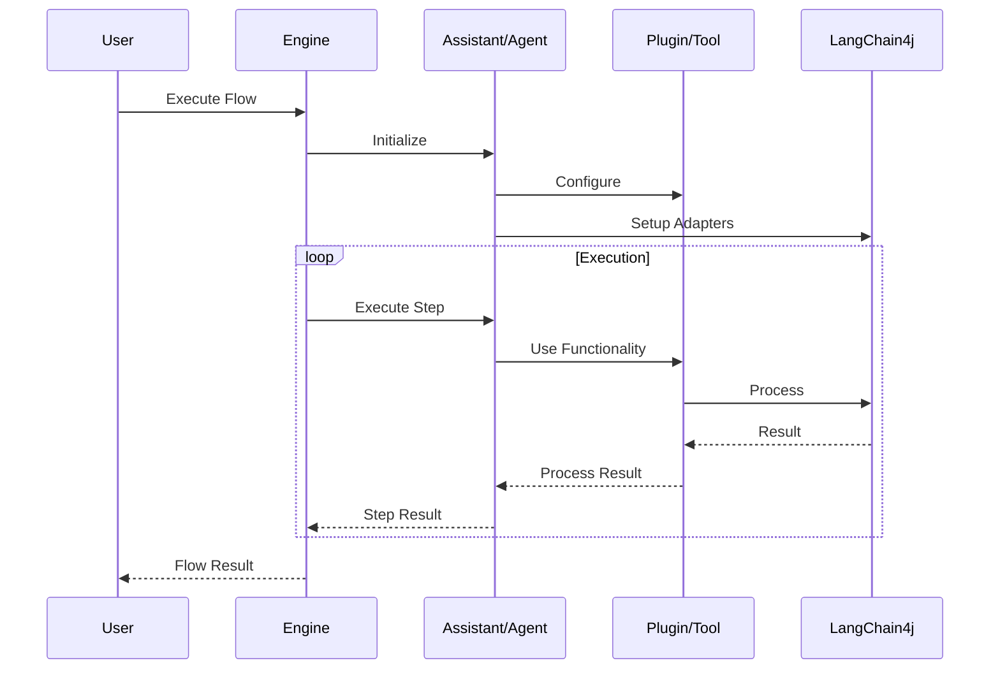
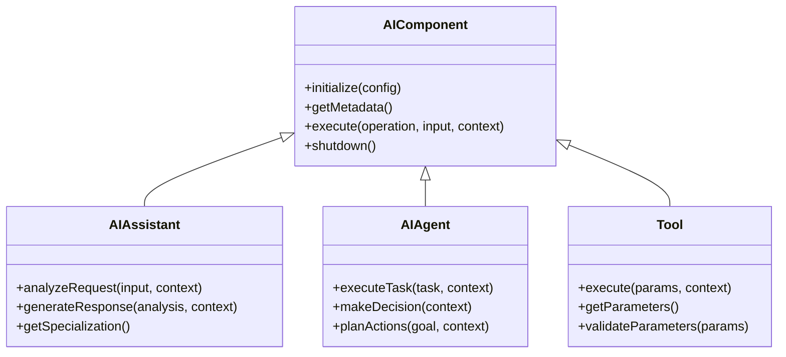
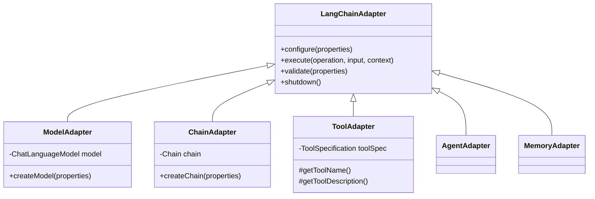
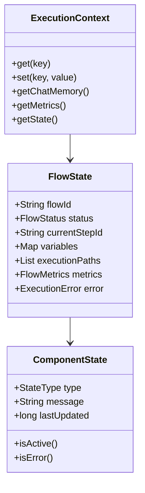

# Componentes de IA no archflow

O archflow fornece uma estrutura hierárquica clara para diferentes tipos de componentes de IA, cada um com seu propósito e capacidades específicas.

## Hierarquia de Componentes

### 1. AIComponent (Interface Base)
A interface base para todos os componentes de IA no archflow, definindo o contrato fundamental:
```java
public interface AIComponent {
   void initialize(Map<String, Object> config);
   ComponentMetadata getMetadata();
   Object execute(String operation, Object input, ExecutionContext context) throws Exception;
   void shutdown();
}
```

### 2. AIAssistant (Assistentes Especializados)
Assistentes são componentes especializados em tarefas específicas, com foco em interação e resposta:
```java
public interface AIAssistant extends AIComponent {
    Analysis analyzeRequest(String input, ExecutionContext context);
    Response generateResponse(Analysis analysis, ExecutionContext context);
    String getSpecialization();
}
```

Exemplos de Assistentes:
- Assistente de Suporte Técnico
   - Análise de tickets
   - Categorização de problemas
   - Respostas padronizadas
   - Escalonamento inteligente

- Assistente de Vendas
   - Análise de leads
   - Qualificação de oportunidades
   - Sugestões de produtos
   - Follow-up automático

- Assistente de Atendimento
   - Análise de sentimento
   - Intenção do cliente
   - Respostas contextualizadas
   - Histórico de interações

### 3. AIAgent (Agentes Autônomos)
Agentes são componentes mais autônomos, capazes de tomar decisões e executar ações:
```java
public interface AIAgent extends AIComponent {
    Result executeTask(Task task, ExecutionContext context);
    Decision makeDecision(ExecutionContext context);
    List<Action> planActions(Goal goal, ExecutionContext context);
}
```

Características dos Agentes:
- Autonomia
   - Tomada de decisão independente
   - Planejamento de ações
   - Execução de tarefas complexas
   - Adaptação ao contexto

- Proatividade
   - Identificação de oportunidades
   - Iniciativa em ações
   - Antecipação de problemas
   - Otimização de processos

- Aprendizado
   - Melhoria contínua
   - Adaptação a feedback
   - Refinamento de estratégias
   - Evolução do conhecimento

### 4. Tool (Ferramentas)
Ferramentas são capacidades específicas que podem ser usadas por Assistentes e Agentes:
```java
public interface Tool extends AIComponent {
    Result execute(Map<String, Object> params, ExecutionContext context);
    List<ParameterDescription> getParameters();
    void validateParameters(Map<String, Object> params);
}
```

Tipos comuns de Plugins:
- Processamento de Dados
   - Análise de dados
   - Transformação de formatos
   - Validação de inputs
   - Agregação de informações

- Integração
   - Conexão com APIs
   - Sincronização de dados
   - Transformação de protocolos
   - Gestão de estado

- Análise
   - Processamento de texto
   - Análise de sentimento
   - Extração de entidades
   - Classificação de conteúdo

## Fluxo de Execução



## Hierarquia de Componentes



## Integração com LangChain4j



## Estado e Contexto



## Principais Diferenças

### 1. Assistentes vs Agentes
- **Escopo de Ação**
   - Assistentes: Focados em interação e resposta
   - Agentes: Focados em execução e decisão

- **Autonomia**
   - Assistentes: Reagem a estímulos
   - Agentes: Tomam iniciativa

- **Complexidade**
   - Assistentes: Fluxos predefinidos
   - Agentes: Adaptação dinâmica

### 2. Plugins vs Ferramentas
- **Granularidade**
   - Plugins: Funcionalidades complexas
   - Ferramentas: Operações específicas

- **Escopo**
   - Plugins: Múltiplas operações
   - Ferramentas: Função única

- **Integração**
   - Plugins: Independentes
   - Ferramentas: Usadas por outros componentes

## Estado e Contexto

### ComponentState
```java
public record ComponentState(
    StateType type,
    String message,
    long lastUpdated
) {
    public enum StateType {
        UNINITIALIZED,
        INITIALIZING,
        READY,
        BUSY,
        ERROR,
        SHUTTING_DOWN,
        SHUTDOWN
    }
}
```

### ExecutionContext
```java
public interface ExecutionContext {
    Optional<Object> get(String key);
    void set(String key, Object value);
    ChatMemory getChatMemory();
    ExecutionMetrics getMetrics();
    FlowState getState();
}
```

## Tipos de Operações

```java
public enum OperationType {
    SYNC,   // Operação síncrona
    ASYNC,  // Operação assíncrona
    STREAM  // Operação streaming
}
```

## Extensibilidade

### 1. Criação de Novos Assistentes
```java
@ComponentDescriptor(
    id = "custom-assistant",
    type = ComponentType.ASSISTANT,
    version = "1.0.0"
)
public class CustomAssistant implements AIAssistant {
    // Implementação customizada
}
```

### 2. Desenvolvimento de Agentes Especializados
```java
@ComponentDescriptor(
    id = "specialized-agent",
    type = ComponentType.AGENT,
    version = "1.0.0"
)
public class SpecializedAgent implements AIAgent {
    // Lógica específica do agente
}
```

### 3. Adição de Plugins para Novas Integrações
```java
@ComponentDescriptor(
    id = "integration-plugin",
    type = ComponentType.PLUGIN
)
public class IntegrationPlugin implements ComponentPlugin {
    @Override
    public void validateConfig(Map<String, Object> config) {
        // Validação de configuração
    }
    
    @Override
    public void onLoad(ExecutionContext context) {
        // Inicialização do plugin
    }
}
```

### 4. Criação de Ferramentas Personalizadas
```java
@ComponentDescriptor(
    id = "custom-tool",
    type = ComponentType.TOOL
)
public class CustomTool implements Tool {
    @Override
    public Result execute(Map<String, Object> params, ExecutionContext context) {
        // Implementação da ferramenta
    }
    
    @Override
    public List<ParameterDescription> getParameters() {
        // Definição de parâmetros
    }
}
```

### 5. Adaptadores Personalizados
```java
public class CustomAdapter implements LangChainAdapter {
    @Override
    public void configure(Map<String, Object> properties) {
        // Configuração do adaptador
    }
    
    @Override
    public Object execute(String operation, Object input, ExecutionContext context) {
        // Lógica de execução
    }
}
```

### 6. Expansão de Capacidades
- Adicionar novos tipos de análise
- Implementar estratégias de decisão
- Criar novos tipos de processamento
- Desenvolver integrações customizadas
- Adicionar suporte a novos modelos de IA

### 7. Personalização de Comportamento
- Override de métodos padrão
- Implementação de políticas próprias
- Customização de estratégias
- Definição de regras de negócio
- Adaptação a requisitos específicos

## Próximos Passos

1. **Expansão de Capacidades**
   - Mais tipos de assistentes
   - Agentes mais complexos
   - Novas ferramentas

2. **Melhorias de Integração**
   - Mais adaptadores LangChain4j
   - Suporte a novos LLMs
   - Plugins de terceiros

3. **Observabilidade**
   - Métricas detalhadas
   - Logs estruturados
   - Rastreamento de execução

4. **Segurança**
   - Validação avançada
   - Controle de acesso
   - Auditoria de uso