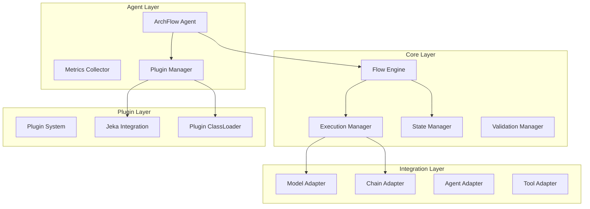
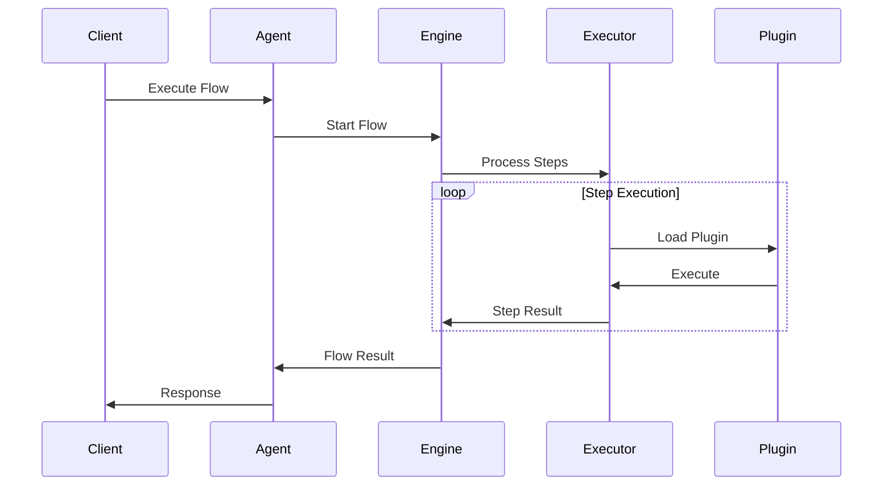

# Arquitetura do archflow

## Visão Geral da Arquitetura

O archflow implementa uma arquitetura modular focada em execução robusta de fluxos de IA, com integração nativa ao LangChain4j.



## Componentes Implementados

### 1. Core Engine

#### Flow Engine (DefaultFlowEngine)
```java
public class DefaultFlowEngine implements FlowEngine {
    // Gerencia execução de fluxos
    private final ExecutionManager executionManager;
    // Gerencia estado dos fluxos
    private final StateManager stateManager;
    // Repositório de fluxos
    private final FlowRepository flowRepository;
    // Validação de fluxos
    private final FlowValidator flowValidator;
    // Execuções ativas
    private final Map<String, FlowExecution> activeExecutions;
}
```

#### Execution Manager
- Controle de execução de fluxos
- Gerenciamento de ciclo de vida
- Execução paralela de steps
- Tratamento de erros e recuperação

#### State Manager
- Persistência de estado
- Gestão de contexto
- Controle de execução
- Auditoria de operações

### 2. Agent Layer

#### ArchFlow Agent
```java
public class ArchFlowAgent implements AutoCloseable {
    // Configuração do agente
    private final AgentConfig config;
    // Gerenciador de plugins
    private final FlowPluginManager pluginManager;
    // Coletor de métricas
    private final MetricsCollector metricsCollector;
    // Engine de execução
    private final FlowEngine flowEngine;
}
```

#### Metrics Collector
- Métricas de execução
- Monitoramento de recursos
- Tracking de steps
- Gestão de erros

#### Plugin Manager
- Carregamento dinâmico
- Gestão de dependências com Jeka
- Isolamento de classloader
- Controle de ciclo de vida

### 3. LangChain4j Integration

#### Model Adapter
```java
public class ModelAdapter implements LangChainAdapter {
    // Configuração do modelo
    private ChatLanguageModel model;
    // Gerenciamento de propriedades
    private Map<String, Object> properties;
}
```

#### Chain Adapter
- Integração com ConversationalChain
- Gestão de memória
- Configuração de modelos
- Processamento de respostas

#### Tool Adapter
- Especificação de ferramentas
- Validação de parâmetros
- Execução de operações
- Gestão de resultados

### 4. Plugin System

#### Plugin Manager
```java
public class FlowPluginManager {
    // Diretório de plugins
    private final String pluginsPath;
    // ClassLoader de plugins
    private URLClassLoader pluginClassLoader;
    // Plugins carregados
    private final Map<String, PluginInfo> loadedPlugins;
}
```

#### Jeka Integration
- Resolução de dependências
- Download de artefatos
- Gestão de repositórios
- Controle de versões

## Fluxo de Execução



## Considerações de Design

### Escalabilidade
- Execução paralela de steps
- Gerenciamento de recursos
- Controle de concorrência
- Plugin isolation

### Resiliência
- Retry policies
- Error handling
- Estado persistente
- Recuperação de falhas

### Performance
- ClassLoader otimizado
- Caching de plugins
- Execução assíncrona
- Resource pooling

### Segurança
- Isolamento de plugins
- Validação de entradas
- Controle de recursos
- Auditoria de execução

## Próximos Passos

1. **Expansão do Core**
    - Implementar novos tipos de steps
    - Melhorar validação de fluxos
    - Adicionar mais adaptadores
    - Expandir métricas

2. **Melhorias no Agent**
    - Sistema de plugins mais robusto
    - Mais opções de configuração
    - Better resource management
    - Enhanced monitoring

3. **Integração LangChain4j**
    - Suporte a mais modelos
    - Chains customizadas
    - Ferramentas especializadas
    - Memória avançada