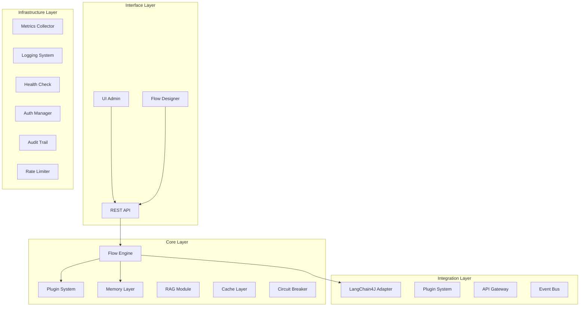
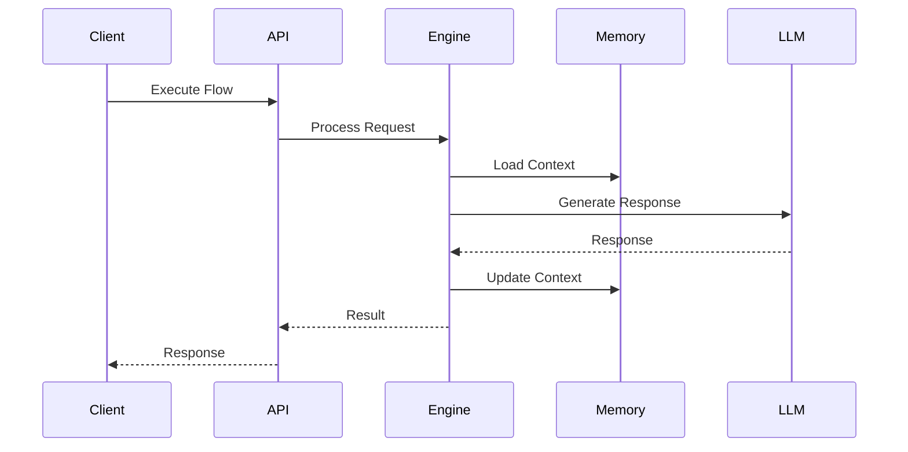

# Arquitetura do archflow

## Visão Geral da Arquitetura

O archflow é projetado com uma arquitetura modular e extensível, dividida em camadas distintas que permitem escalabilidade, segurança e manutenibilidade.

## Camadas da Arquitetura

### 1. Core Engine (Núcleo)

#### Agent Manager
- Gerenciamento do ciclo de vida dos agentes
- Configuração e estado dos agentes
- Balanceamento de carga
- Recuperação de falhas

#### Workflow Orchestrator
- Execução de fluxos de trabalho
- Gerenciamento de estado
- Tratamento de erros
- Pipeline de execução

#### Memory Layer
- Gerenciamento de memória distribuída
- Suporte a múltiplos backends (Redis, PostgreSQL)
- Cache de contexto
- Persistência de estado

#### RAG Module
- Sistema de recuperação aumentada
- Embeddings e vetorização
- Busca semântica
- Integração com bases de conhecimento

#### Cache Layer
- Otimização de prompts
- Cache de respostas
- Gerenciamento de TTL
- Invalidação inteligente

#### Circuit Breaker
- Proteção contra falhas
- Rate limiting
- Fallback strategies
- Recuperação automática

### 2. Integração

#### LangChain4J Adapter
- Integração com múltiplos LLMs
- Gerenciamento de modelos
- Otimização de tokens
- Handling de respostas

#### Plugin System
- Carregamento dinâmico
- Isolamento de classloader
- Gerenciamento de dependências
- Hot reload

#### API Gateway
- REST/GraphQL endpoints
- Validação de requisições
- Roteamento
- Transformação de dados

#### Event Bus
- Processamento assíncrono
- Pub/sub
- Dead letter queue
- Retry policies

### 3. Monitoramento & Observabilidade

#### Metrics Collector
- Integração Micrometer/Prometheus
- Métricas customizadas
- Dashboards Grafana
- Alertas

#### Logging System
- Log estruturado
- Trace distribuído
- Agregação ELK
- Rotação de logs

#### Health Check
- Monitoramento de componentes
- Verificações de dependências
- Auto-healing
- Status endpoints

#### Performance Analytics
- Análise de uso
- Profiling
- Bottleneck detection
- Otimização automática

### 4. Segurança

#### Auth Manager
- OAuth2/OpenID Connect
- API Keys
- RBAC/ABAC
- SSO integration

#### Audit Trail
- Logging detalhado
- Compliance
- Histórico de mudanças
- Exportação de dados

#### Rate Limiter
- Controle por usuário/org
- Quotas
- Throttling
- Fair use policies

#### Data Protection
- Criptografia
- Mascaramento de dados
- PII handling
- Compliance (GDPR/LGPD)

## Fluxo de Dados

## Considerações de Design

### Escalabilidade
- Arquitetura distribuída
- Stateless quando possível
- Cache em múltiplas camadas
- Horizontal scaling

### Resiliência
- Circuit breakers
- Fallback strategies
- Retry policies
- Error handling

### Performance
- Otimização de prompts
- Pooling de conexões
- Caching inteligente
- Lazy loading

### Segurança
- Defense in depth
- Principle of least privilege
- Secure by default
- Compliance first

## Próximos Passos

- [Módulos Detalhados](modules.md)
- [Sistema de Plugins](plugins.md)
- [Configuração](configuration.md)
- [Deployment](deployment.md)