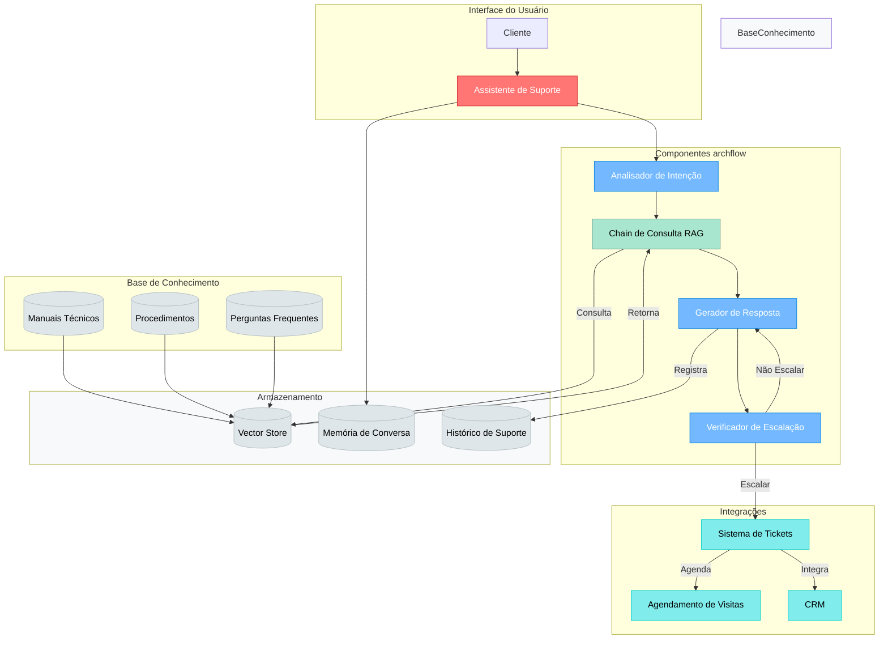
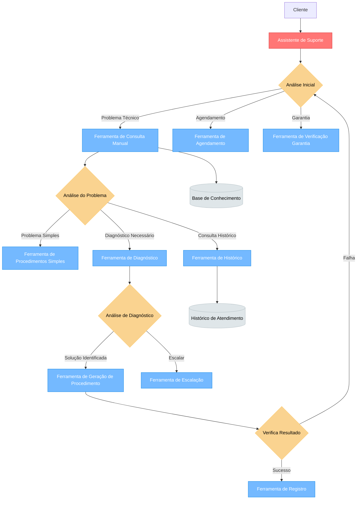
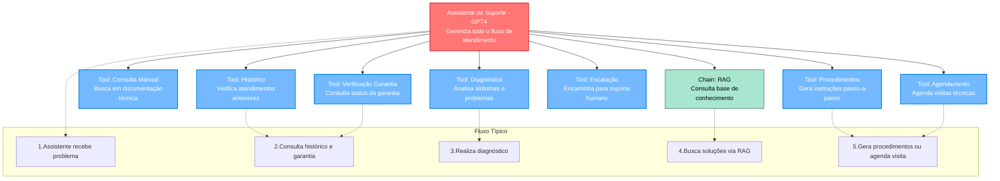

# Assistente de Suporte Técnico de Geladeiras

## 1. Caso de Uso

### 1.1 Problema
Uma empresa de eletrodomésticos precisa de um assistente virtual para dar suporte técnico aos clientes sobre geladeiras. O assistente deve:

1. Entender problemas comuns relatados pelos clientes
2. Consultar documentação técnica dos produtos
3. Fornecer soluções passo-a-passo
4. Escalar para atendimento humano quando necessário
5. Manter histórico do atendimento
6. Gerar relatórios de atendimento

### 1.2 Funcionalidades Necessárias
- Análise de problemas relatados
- Busca em manuais técnicos
- Diagnóstico baseado em sintomas
- Geração de procedimentos de resolução
- Verificação de garantia
- Agendamento de visitas técnicas

## 2. Arquitetura da Solução

### 2.1 Visão Geral do Fluxo


### 2.2 Processo de Decisão e Uso de Ferramentas


### 2.3 Componentes de IA 


## 3. Funcionamento do Assistente

### 3.1 Coordenação e Tomada de Decisão
O Assistente funciona como um "coordenador inteligente" que:
- Entende o contexto completo da conversa
- Planeja a sequência de ações necessárias
- Escolhe as ferramentas apropriadas para cada situação
- Avalia resultados e ajusta o plano conforme necessário
- Mantém a coerência do atendimento

### 3.2 Exemplo de Interação
```text
Cliente: "Minha geladeira não está gelando"

Assistente (pensamento):
1. Preciso verificar o histórico -> usa HistoricoTool
2. Preciso diagnóstico inicial -> usa DiagnosticoTool
3. Baseado no diagnóstico:
   - Se for problema conhecido -> usa ConsultaManual
   - Se precisar mais info -> pede ao cliente
   - Se for complexo -> usa EscalacaoTool
```

### 3.3 Fluxo de Decisão
```text
Cliente: "Quero agendar um técnico na garantia"

Assistente (pensamento):
1. Verificar garantia -> usa GarantiaTool
2. Se em garantia:
   - Consultar agenda -> usa AgendamentoTool
   - Registrar chamado -> usa RegistroSolucao
3. Se fora da garantia:
   - Consultar procedimentos -> usa ConsultaManual
   - Oferecer alternativas
```

## 4. Implementação

### 4.1 Componentes Necessários
1. **Assistant Principal**
   - Configurado com GPT-4
   - Prompt base para suporte técnico
   - Gerenciamento de contexto

2. **Tools de Análise**
   - Diagnóstico
   - Consulta Manual
   - Histórico
   - Verificação de Garantia

3. **Tools de Ação**
   - Agendamento
   - Escalação
   - Procedimentos

4. **Chain RAG**
   - Integração com Vector Store
   - Consulta base de conhecimento

### 4.2 Fluxo de Dados
1. **Entrada**
   - Recebimento da solicitação do cliente
   - Análise inicial do contexto

2. **Processamento**
   - Escolha de ferramentas apropriadas
   - Execução de ações necessárias
   - Avaliação de resultados

3. **Saída**
   - Geração de resposta ao cliente
   - Registro de ações tomadas
   - Atualização de histórico

## 5. Considerações

### 5.1 Vantagens
- Solução flexível e escalável
- Automação inteligente do suporte
- Integração com sistemas existentes
- Aprendizado contínuo

### 5.2 Pontos de Atenção
- Garantir qualidade das respostas
- Manter base de conhecimento atualizada
- Monitorar taxa de escalação
- Avaliar satisfação do cliente