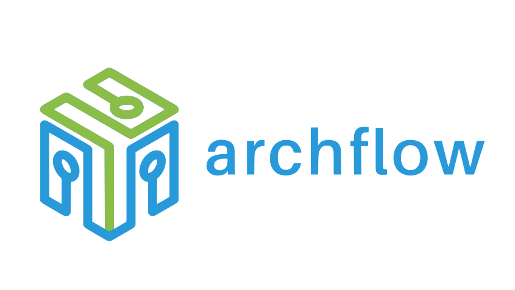

# Documentação do archflow

Framework open source para automação de agentes de IA em Java

## 📚 Conteúdo

### Introdução
- [Visão Geral](overview.md) - Introdução ao archflow
- [Roadmap](roadmap.md) - Planejamento e próximos passos

### Arquitetura
- [Arquitetura Geral](architecture/architecture.md) - Design e estrutura do sistema
- [Componentes de IA](architecture/ai-components.md) - Detalhes dos componentes de IA
- [Módulos Internos](architecture/internal-modules.md) - Provider Hub, Handoff, Invocation Queue, Governance, Summarization, Query Router, Realtime — e o status de cada fonte de documentação
- [ADRs](adr/) - Decisões arquiteturais (0001 runtime substrate, 0002 orquestração dinâmica, 0003 AG-UI, 0004 mutabilidade do ExecutionContext)

### Diagramas

#### Engine
- [Diagrama do Engine](architecture/diagrams/engine/engine-diagram.mermaid) - Estrutura do motor de execução

#### Modelo de Domínio
- [Diagrama de IA](architecture/diagrams/model/ai-diagram.mermaid) - Componentes de IA
- [Diagrama do Engine](architecture/diagrams/model/engine-diagram.mermaid) - Engine e execução
- [Diagrama de Erros](architecture/diagrams/model/error-enums-diagram.mermaid) - Estrutura de erros
- [Diagrama de Fluxo](architecture/diagrams/model/flow-diagram.mermaid) - Fluxos de trabalho

#### Sistema de Plugins
- [API de Plugins](architecture/diagrams/plugin-api/plugin-api-diagram.mermaid) - API do sistema de plugins
- [Carregador de Plugins](architecture/diagrams/plugin-loader/plugin-loader-diagram.mermaid) - Sistema de carregamento

### Desenvolvimento
- [Guia de Início Rápido](development/quickstart.md) - Começando com archflow
- [Stack Tecnológico](development/stack.md) - Tecnologias utilizadas
- [Features](development/features.md) - Funcionalidades disponíveis
- [Guia de Contribuição](development/contributing.md) - Como contribuir

### Comunidade
- [Comunidade](community/README.md) - Recursos da comunidade

## 🎨 Recursos Visuais

### Logos
- [Logo Horizontal (SVG)](images/logo_horizontal.svg)
- [Logo Horizontal (PNG)](images/logo_horizontal.png)
- [Logo Vertical (SVG)](images/logo_vertical.svg)
- [Logo Vertical (PNG)](images/logo_vertical.png)

## 📖 Como Usar esta Documentação

1. **Novos Usuários**
    - Comece pela [Visão Geral](overview.md)
    - Siga para o [Guia de Início Rápido](development/quickstart.md)
    - Explore os [Exemplos](development/examples)

2. **Desenvolvedores**
    - Consulte a [Arquitetura](architecture/architecture.md)
    - Entenda os [Componentes de IA](architecture/ai-components.md)
    - Veja os [Diagramas](#diagramas) para detalhes técnicos

3. **Contribuidores**
    - Leia o [Guia de Contribuição](development/contributing.md)
    - Verifique o [Roadmap](roadmap.md)
    - Participe da [Comunidade](community/README.md)

## 🔄 Mantendo a Documentação

### Diretrizes
- Mantenha a documentação atualizada com o código
- Atualize os diagramas quando houver mudanças arquiteturais
- Siga o padrão de formatação existente
- Inclua exemplos práticos sempre que possível

### Formato dos Diagramas
- Diagramas são mantidos em formato Mermaid
- Arquivos `.mermaid` podem ser visualizados no GitHub
- Use ferramentas como [Mermaid Live Editor](https://mermaid.live) para edição

## 🤝 Contribuindo com a Documentação

1. Faça um fork do repositório
2. Crie uma branch para suas alterações
3. Submeta um Pull Request
4. Aguarde a revisão

Para mais detalhes, consulte o [Guia de Contribuição](development/contributing.md).

## 📝 License

Este projeto está licenciado sob a [Apache License 2.0](../LICENSE).