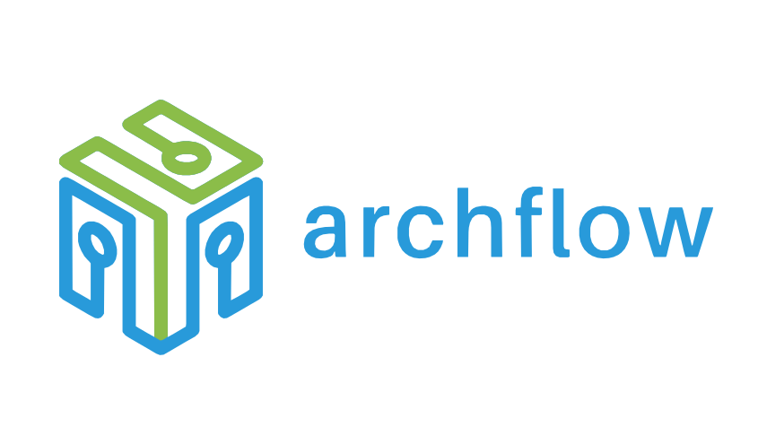

# archflow

<div align="center">

[](LICENSE)
[](https://github.com/archflow/archflow/actions)
[](https://search.maven.org/search?q=g:br.com.archflow)
[](https://adoptium.net/)
[](https://discord.gg/archflow)



**Framework open source para automação de agentes de IA em Java**

[Website](https://archflow.github.io) • [Documentação](docs/README.md) • [Quickstart](docs/development/quickstart.md) • [Discord](https://discord.gg/archflow)

</div>

## ✨ Por que archflow?

O archflow é um framework para criar, executar e gerenciar fluxos de trabalho baseados em IA de forma robusta e escalável. Construído sobre [LangChain4j](https://github.com/langchain4j/langchain4j), ele oferece:

- 🎯 **Fluxo Estruturado**: Desenvolva fluxos de IA modulares e reutilizáveis em Java
- 🚀 **Alta Performance**: Execução otimizada e escalável com suporte a processamento paralelo
- 🔌 **Extensibilidade**: Sistema robusto de plugins com gerenciamento automático de dependências
- 🛡️ **Controle Total**: Gestão completa do ciclo de vida dos fluxos, com monitoramento detalhado
- 📊 **Observabilidade**: Métricas detalhadas e auditoria completa de execuções
- 🏭 **Produção Ready**: Projetado para ambientes empresariais com foco em confiabilidade

## 🎯 Componentes Principais

### 🤖 Core Engine
- Execução de fluxos distribuída
- Gerenciamento de estado
- Controle de ciclo de vida
- Processamento paralelo
- Tratamento de erros robusto

### 📚 Integração com LangChain4j
- ModelAdapter para diferentes LLMs
- ChainAdapter para sequências de processamento
- AgentAdapter para execução autônoma
- ToolAdapter para funcionalidades específicas
- MemoryAdapter para gestão de contexto

### 🔒 Gestão de Plugins
- Carregamento dinâmico
- Versionamento automático
- Resolução de dependências via Jeka
- Isolamento de classloader
- Hot reload de componentes

### 📊 Monitoramento
- Métricas de execução detalhadas
- Tracking de uso de recursos
- Auditoria de operações
- Logging estruturado
- Alertas e notificações

## 🔌 Recursos Implementados

### 1. Engine de Execução
- Execução assíncrona de fluxos
- Gestão de estado distribuída
- Controle de ciclo de vida
- Processamento paralelo
- Retry policies

### 2. Sistema de Plugins
- Carregamento dinâmico
- Gestão de dependências
- Versionamento
- Isolamento
- Hot reload

### 3. Monitoramento e Métricas
- Performance metrics
- Resource utilization
- Execution tracking
- Error monitoring
- Audit logging

### 4. Adaptadores LangChain4j
- Integração com LLMs
- Chain processing
- Agent execution
- Tool management
- Memory handling

## 💻 Requisitos de Sistema

- Java 17 ou superior
- Maven 3.8+
- Memória: 4GB RAM (mínimo)
- Disco: 1GB disponível
- Sistema Operacional: Linux, Windows ou macOS

## 🚀 Início Rápido

### Dependências Maven
```xml
<dependencies>
    <dependency>
        <groupId>br.com.archflow</groupId>
        <artifactId>archflow-core</artifactId>
        <version>1.0.0-SNAPSHOT</version>
    </dependency>
    <dependency>
        <groupId>br.com.archflow</groupId>
        <artifactId>archflow-agent</artifactId>
        <version>1.0.0-SNAPSHOT</version>
    </dependency>
    <dependency>
        <groupId>br.com.archflow</groupId>
        <artifactId>archflow-langchain4j</artifactId>
        <version>1.0.0-SNAPSHOT</version>
    </dependency>
</dependencies>
```

### Exemplo de Fluxo
```java
public class CustomerSupportFlow implements Flow {
    @Override
    public String getId() {
        return "customer-support";
    }

    @Override
    public List<FlowStep> getSteps() {
        return Arrays.asList(
            new IntentAnalysisStep(),
            new ResponseGenerationStep()
        );
    }

    @Override
    public FlowConfiguration getConfiguration() {
        return FlowConfiguration.builder()
            .timeout(30000)
            .retryPolicy(new RetryPolicy(3, 1000, 2.0))
            .build();
    }
}
```

### Executando o Fluxo
```java
AgentConfig config = AgentConfig.builder()
    .agentId("support-agent")
    .pluginsPath("plugins")
    .maxConcurrentFlows(10)
    .build();

try (ArchFlowAgent agent = new ArchFlowAgent(config)) {
    Flow flow = new CustomerSupportFlow();
    Map<String, Object> input = Map.of("message", "Como posso resetar minha senha?");
    
    FlowResult result = agent.executeFlow(flow, input).get();
    System.out.println("Status: " + result.getStatus());
    System.out.println("Output: " + result.getOutput().orElse(null));
}
```

## 📦 Módulos

- **archflow-core**: Engine de execução, interfaces base e contratos principais
- **archflow-model**: Modelos de domínio e estruturas de dados
- **archflow-plugin-api**: Sistema de catálogo e API para desenvolvimento de plugins
- **archflow-plugin-loader**: Carregamento dinâmico de plugins com Jeka
- **archflow-agent**: Agente de execução com gestão de plugins e métricas
- **archflow-langchain4j**: Adaptadores para integração com LangChain4j

## 🌱 Começando

1. **Setup do Ambiente**
   ```bash
   git clone https://github.com/archflow/archflow.git
   cd archflow
   mvn clean install
   ```

2. **Primeiro Fluxo**
   - [Guia de Início Rápido](docs/development/quickstart.md)
   - [Tutoriais](docs/tutorials/README.md)
   - [Exemplos](docs/examples/README.md)

## 🤝 Contribuindo

Adoramos contribuições! Veja como você pode ajudar:

- 🐛 Reporte bugs e sugira features nas [Issues](https://github.com/archflow/archflow/issues)
- 📖 Melhore a [documentação](docs/README.md)
- 💻 Contribua com código seguindo nosso [guia](docs/development/contributing.md)
- 🌟 Dê uma estrela no projeto e compartilhe!

## 📚 Links

- [Website](https://archflow.github.io)
- [Documentação](docs/README.md)
- [Discord](https://discord.gg/archflow)
- [Blog](https://blog.archflow.org)

## 📄 Licença

archflow é licenciado sob [Apache License 2.0](LICENSE).

## 🙏 Agradecimentos

- [LangChain4j](https://github.com/langchain4j/langchain4j) - Framework de base para processamento de IA
- [Jeka](https://jeka.dev) - Gerenciamento de dependências
- [Contribuidores](https://github.com/archflow/archflow/graphs/contributors)

---

<div align="center">
⭐️ Se você gosta do archflow, considere dar uma estrela no projeto! ⭐️

[Comece Agora](docs/development/quickstart.md) • [Aprenda Mais](docs/README.md) • [Contribua](docs/development/contributing.md)
</div>