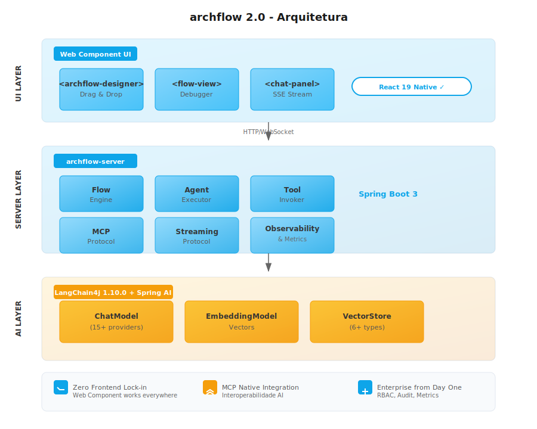

# archflow

<div align="center">

[](LICENSE)
[](https://adoptium.net/)
[](https://spring.io/projects/spring-boot)
[](https://github.com/langchain4j/langchain4j)

**Primeira Plataforma Visual Java-Nativa para IA**

O LangFlow para o mundo Java — Visual AI Builder com Web Component UI

[Features](#-por-que-archflow) • [Quickstart](#-início-rápido) • [Documentação](docs-site/) • [Examples](examples/)

</div>

---

## ✨ Por que archflow?

### O Problema

**78% dos CIOs** citam compliance como barreira para adotar IA.
Empresas Java enfrentam um dilema hoje:

| Opção | Vantagem | Desvantagem |
|-------|----------|--------------|
| **LangFlow / n8n / Dify** | Visual, fácil de usar | ❌ Python/Node.js → não integra com stack Java |
| **Spring AI / LangChain4j** | Java-nativo | ❌ Apenas código → requer especialistas AI |
| **Camunda 8** | Java, enterprise | ❌ BPMN tradicional → não AI-native |

### A Solução

**archflow** é a primeira plataforma visual Java-Nativa para construção de workflows de IA:

<div align="center">

```html
<!-- Funciona em QUALQUER framework -->
<archflow-designer
  workflow-id="customer-support-flow"
  api-base="https://api.archflow.com"
  theme="dark">
</archflow-designer>
```

</div>

### 🎯 Diferenciais Únicos

| Feature | archflow | Python Solutions | Java Frameworks |
|---------|----------|-------------------|-----------------|
| **Backend Java** | ✅ | ❌ | ✅ |
| **Visual Builder** | ✅ | ✅ | ❌ |
| **Web Component UI** | ✅ **ÚNICO** | ❌ | ❌ |
| **Zero Frontend Lock-in** | ✅ | ❌ | ❌ |
| **MCP Native** | ✅ | ⚠️ | ❌ |
| **Enterprise Features** | ✅ | ⚠️ | ✅ |
| **Spring Integration** | ✅ | ❌ | ✅ |

---

## 🚀 Features

### 🎨 Web Component Designer

- **Zero lock-in**: Funciona em React, Vue, Angular, Svelte, vanilla
- **Drag-and-drop**: Crie workflows AI visualmente
- **15+ nodes nativos**: LLM, Tools, Vector Search, Conditions, Parallel, etc.
- **Distribuição via npm**: `npm install @archflow/component`

### 🤖 Java-Nativo AI Engine

- **LangChain4j 1.10.0**: Framework de IA mais moderno do ecossistema Java
- **Spring Boot 3.x**: Integração nativa com o ecossistema Spring
- **15+ LLM Providers**: OpenAI, Anthropic, Azure, AWS, Google, DeepSeek, e mais
- **MCP Protocol**: Interoperabilidade com o ecossistema de AI tools

### 🏢 Enterprise from Day One

- **RBAC**: Controle de acesso baseado em roles
- **Audit Logging**: Rastreabilidade completa de execuções
- **Observabilidade**: Metrics (Prometheus), Tracing (OpenTelemetry), Logging
- **API Keys**: Autenticação programática
- **Suspend/Resume**: Conversações interativas multi-step

---

## 📐 Arquitetura



---

## 🚀 Início Rápido

### Requisitos

- Java 17+
- Maven 3.9+
- React 19+ (para UI)
- Docker (opcional, para containers)

> **React 19 + Web Components**: archflow usa Web Components que funcionam nativamente com React 19 (lançado Dez/2024). Zero conversão necessária!

### Spring Boot Starter

```xml
<dependency>
    <groupId>br.com.archflow</groupId>
    <artifactId>archflow-spring-boot-starter</artifactId>
    <version>1.0.0</version>
</dependency>
```

### Docker

```bash
docker run -d \
  -p 8080:8080 \
  -e ARCHFLOW_API_KEY=your-key-here \
  archflow/server:1.0.0
```

### Web Component

```bash
npm install @archflow/component
```

```html
<archflow-designer
  workflow-id="customer-support"
  api-base="http://localhost:8080/api"
  theme="dark">
</archflow-designer>

<script>
  const designer = document.querySelector('archflow-designer');
  designer.addEventListener('workflow-saved', (e) => {
    console.log('Workflow saved:', e.detail);
  });
</script>
```

---

## 📦 Módulos

```
archflow/
├── archflow-core/                    # Core engine
├── archflow-model/                   # Domain models (Workflow interface)
├── archflow-agent/                   # Agent execution
├── archflow-plugin-api/              # Plugin SPI
├── archflow-plugin-loader/           # Plugin loading system
├── archflow-langchain4j/             # LangChain4j 1.10.0 integration
│   ├── archflow-langchain4j-core/    # Base interfaces
│   ├── archflow-langchain4j-openai/  # OpenAI + GPT-4.1, o1
│   ├── archflow-langchain4j-anthropic/# Claude 3.5/3.7 Sonnet
│   ├── archflow-langchain4j-mcp/     # MCP Protocol
│   ├── archflow-langchain4j-streaming/ # Streaming support
│   ├── archflow-langchain4j-provider-hub/ # Multi-LLM Hub
│   └── archflow-langchain4j-chain-rag/ # RAG Chain
├── archflow-templates/               # ✅ Workflow templates
├── archflow-conversation/            # ✅ Suspend/Resume conversations
├── archflow-marketplace/             # ✅ Extension marketplace
├── archflow-workflow-tool/           # ✅ Workflow-as-Tool pattern
├── archflow-security/                # ✅ RBAC, SSO
├── archflow-observability/           # ✅ Metrics, tracing, audit
├── archflow-performance/             # ✅ Caching, pooling, parallel execution
├── archflow-server/                  # ✅ Spring Boot 3 server
│   ├── archflow-api/                 # ✅ REST/WebSocket APIs
│   ├── archflow-mcp/                 # ✅ MCP Server implementation
│   └── archflow-streaming/           # ✅ SSE/WebSocket streaming
├── archflow-ui/                      # ✅ Web Component distribution
│   └── archflow-component/           # ✅ <archflow-designer>
└── archflow-enterprise/              # Optional enterprise module
```

✅ = Implementado na v1.0.0

---

## 🗺️ Roadmap

### v1.0.0 (Current Development)

| Fase | Sprint | Descrição | Status |
|------|--------|-----------|--------|
| **Fase 1** | 1-4 | Foundation - LangChain4j 1.10.0, Streaming, MCP | ✅ COMPLETO |
| **Fase 2** | 5-8 | Visual Experience - Web Component Designer | ✅ COMPLETO |
| **Fase 3** | 9-12 | Enterprise Capabilities - RBAC, Observability | ✅ COMPLETO |
| **Fase 4** | 13-16 | Ecosystem - Templates, Marketplace, Workflow-as-Tool | ✅ COMPLETO |
| **Fase 5** | 17-20 | Polish & Launch - Performance, Docs, Examples | ✅ COMPLETO |

**Progresso Atual:** 100% COMPLETO 🎉

**Fase 4: Ecosystem ✅**
- ✅ Sprint 13: Workflow Templates (Customer Support, Document Processing, Knowledge Base, Agent Supervisor)
- ✅ Sprint 14: Suspend/Resume Conversations (Form rendering, SuspendedConversation state)
- ✅ Sprint 15: Extension Marketplace (ExtensionManifest, signature verification, RBAC)
- ✅ Sprint 16: Workflow-as-Tool Pattern (WorkflowTool, registry, composition)

**Conquistado Recentemente:**
- ✅ 4 Workflow Templates prontos para uso
- ✅ Sistema de Suspend/Resume com ArchflowEvent protocol
- ✅ FormData com validação e múltiplos tipos de campo
- ✅ Extension Marketplace com verificação de assinatura
- ✅ Workflow-as-Tool para composição de workflows

**Fase 5: Polish & Launch ✅**
- ✅ Sprint 17: Performance (Caffeine caching, connection pooling, virtual threads)
- ✅ Sprint 18: DX & Docs (Docusaurus site, API reference, guides)
- ✅ Sprint 19: Examples (Spring Boot, React, Vue demos)
- ✅ Sprint 20: Launch 1.0.0 (Release notes, changelog)
- ✅ Web Component `<archflow-designer>` framework-agnostic
- ✅ Integração React e Vue funcionando
- ✅ Sistema de execução com SSE streaming
- ✅ Multi-LLM Provider Hub (15+ providers)
- ✅ Tool Interceptor Chain (caching, logging, metrics, guardrails)
- ✅ toolCallId Tracking System
- ✅ Func-Agent Mode (execução determinística)

[Ver roadmap detalhado](docs/roadmap/STATUS-PROJETO.md)

---

## 📚 Documentação

Documentação completa disponível em [docs-site/](docs-site/)

- [Introdução](docs-site/docs/intro) - Bem-vindo ao archflow
- [Instalação](docs-site/docs/instalacao) - Como configurar
- [Conceitos](docs-site/docs/conceitos/) - Arquitetura, Workflows, Agentes, Tools
- [Guias](docs-site/docs/guias/) - Primeiro workflow, Agente AI, RAG, Multi-agente
- [API Reference](docs-site/docs/api/) - Core, Agent, LangChain4j, Streaming
- [Integrações](docs-site/docs/integracoes/) - Spring Boot, MCP, Observabilidade

## 🎓 Exemplos

Exemplos completos disponíveis em [examples/](examples/)

- [Spring Boot Example](examples/spring-boot/) - Aplicação completa Spring Boot
- [React Example](examples/react/) - Integração com React
- [Vue Example](examples/vue/) - Integração com Vue 3

---

## 🤝 Contribuindo

Contribuições são bem-vindas! Por favor:

1. Leia nosso [Guia de Contribuição](CONTRIBUTING.md)
2. Verifique [Issues abertas](https://github.com/archflow/archflow/issues)
3. Join nosso [Discord](https://discord.gg/archflow)

---

## 💬 Comunidade

- [Discord](https://discord.gg/archflow) - Chat em tempo real
- [GitHub Discussions](https://github.com/archflow/archflow/discussions) - Discussões técnicas
- [Twitter/X](https://twitter.com/archflow_dev) - Novidades e atualizações

---

## 📄 Licença

[Apache License 2.0](LICENSE)

---

## 🙏 Agradecimentos

- [LangChain4j](https://github.com/langchain4j/langchain4j) - Framework de IA para Java
- [Spring AI](https://github.com/spring-projects/spring-ai) - Integração Spring com AI
- [Anthropic](https://www.anthropic.com) - Claude models
- [OpenAI](https://openai.com) - GPT models

---

<div align="center">

**⭐️ Se você acredita que o mundo Java precisa de um visual AI builder próprio, dê uma estrela! ⭐️**

[Comece Agora](docs/development/quickstart.md) • [Documentação](docs/readme.md) • [Discord](https://discord.gg/archflow)

Made with ❤️ by the archflow community

</div>
