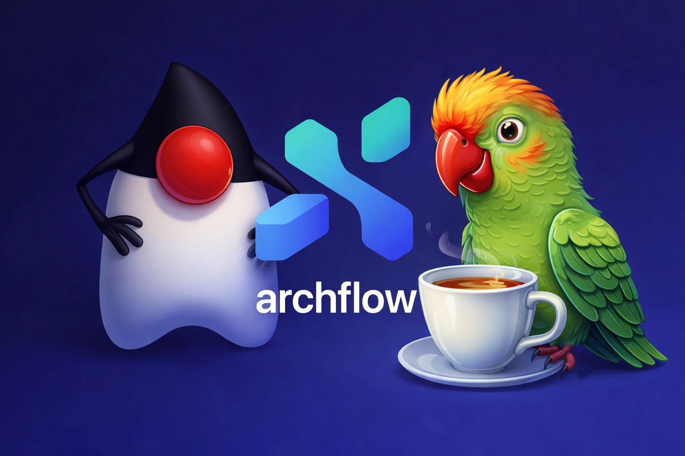
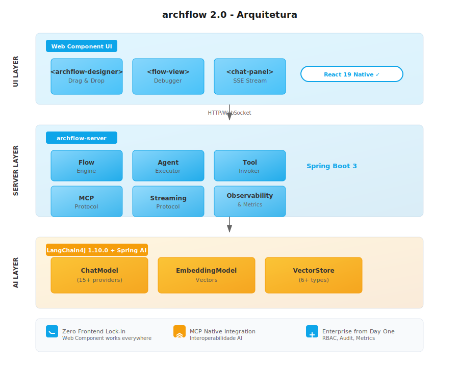

# archflow

<div align="center">

[](LICENSE)
[](https://adoptium.net/)
[](https://spring.io/projects/spring-boot)
[](https://github.com/langchain4j/langchain4j)

**Visual Java-Native Platform for AI Agent Workflows**

Build, visualize, and orchestrate AI agent workflows with a drag-and-drop designer and enterprise-grade Java backend.

</div>

<div align="center">



</div>

<div align="center">

[Features](#features) | [Quickstart](#quickstart) | [Agent Patterns](#agent-patterns) | [Documentation](#documentation) | [Examples](examples/)

</div>

---

## Features

### Visual Workflow Designer

- **Web Component**: `<archflow-designer>` works in React, Vue, Angular, Svelte, or vanilla HTML
- **Drag-and-drop**: Design AI workflows visually with 15+ node types
- **Framework-agnostic**: Zero frontend lock-in via standard Web Components
- **npm distribution**: `npm install @archflow/component`

### Java-Native AI Engine

- **LangChain4j 1.10.0**: 15+ LLM providers (OpenAI, Anthropic, Google, Mistral, Ollama, and more)
- **MCP Protocol**: Model Context Protocol for standardized tool integration
- **Spring Boot 3.3**: Native integration with the Spring ecosystem
- **Suspend/Resume**: Conversational workflows with dynamic forms and human-in-the-loop

### Agent Patterns

archflow implements the industry-standard agent patterns validated by Anthropic, OpenAI, and Google:

| Pattern | Description | Use Case |
|---------|-------------|----------|
| **ReAct** | Thought-Action-Observation loop | General tool use, the default agentic pattern |
| **Plan-and-Execute** | Planner + Executor + Replanner | Multi-step tasks with cost efficiency |
| **ReWOO** | Plan all tool calls upfront with placeholders | Batch processing, predictable workflows |
| **Routing** | Semantic + LLM-based query routing | Multi-domain dispatch (customer support) |
| **Supervisor/Worker** | Orchestrator delegates to specialized agents | Multi-agent coordination |
| **Reflexion** | Self-critique with reflection memory | Tasks with clear success/failure signal |
| **CoT-SC** | Multi-path sampling with majority voting | High-accuracy reasoning |

### Agent Types

| Agent | Description |
|-------|-------------|
| **ConversationalAgent** | Customer service with intent classification, escalation policy, episodic memory |
| **ResearchAgent** | Multi-step research with task decomposition and action planning |
| **DataAnalysisAgent** | Text-to-SQL, schema introspection, statistical analysis |
| **MonitoringAgent** | Continuous metric collection, anomaly detection, alert dispatch |
| **OrchestratorAgent** | Supervisor template with worker coordination and quality checking |

### Enterprise Ready

- **JWT + RBAC**: 4 built-in roles (Admin, Designer, Executor, Viewer)
- **Observability**: OpenTelemetry tracing, Prometheus metrics, audit logging
- **Two-Level Caching**: Caffeine (L1) + Redis (L2) for LLM responses and embeddings
- **Plugin Architecture**: Dynamic plugin loading with SPI discovery and marketplace
- **Production Monitoring**: Prometheus + Grafana + Jaeger stack included

---

## Quickstart

### Spring Boot Starter

```xml
<dependency>
    <groupId>br.com.archflow</groupId>
    <artifactId>archflow-spring-boot-starter</artifactId>
    <version>1.0.0</version>
</dependency>
```

### Docker Compose

```bash
git clone https://github.com/edsonmartins/archflow.git
cd archflow
docker compose up -d
```

This starts the archflow server, PostgreSQL (with pgvector), and Redis.

### Web Component

```bash
npm install @archflow/component
```

```html
<archflow-designer
  workflow-id="customer-support"
  api-base="http://localhost:8080/api"
  theme="dark">
</archflow-designer>
```

---

## Architecture



```
archflow/
├── archflow-model/                     # Domain models
├── archflow-core/                      # Flow engine, validation, execution
├── archflow-agent/                     # Agent patterns (ReAct, Plan-and-Execute, ReWOO, CoT-SC)
│   ├── pattern/                        # ReactAgentExecutor, PlanAndExecuteAgent, ReWOOExecutor
│   ├── handoff/                        # AgentHandoff, AgentHandoffManager
│   └── routing/                        # SemanticRouter (embedding + LLM hybrid)
├── archflow-langchain4j/               # LangChain4j 1.10.0 integration
│   ├── archflow-langchain4j-openai/    # OpenAI adapter
│   ├── archflow-langchain4j-anthropic/ # Anthropic adapter
│   ├── archflow-langchain4j-mcp/       # MCP Protocol client
│   ├── archflow-langchain4j-streaming/ # SSE streaming
│   └── archflow-langchain4j-provider-hub/ # Multi-LLM Hub (15+ providers)
├── archflow-conversation/              # Suspend/resume, episodic memory, forms
├── archflow-security/                  # JWT, RBAC, API keys, CORS
├── archflow-observability/             # OpenTelemetry, Micrometer, audit logging
├── archflow-performance/               # Two-level caching, connection pooling
├── archflow-templates/                 # Workflow templates (Customer Support, etc.)
├── archflow-marketplace/               # Extension marketplace with signature verification
├── archflow-plugins/                   # Built-in agents (Conversational, Research, etc.)
├── archflow-api/                       # REST controllers
├── archflow-ui/                        # React 19 + Web Component designer
├── docs-site/                          # Docusaurus documentation
└── examples/                           # Spring Boot and React examples
```

---

## Agent Patterns

### ReAct (Reason + Act)

```java
ReactAgentExecutor executor = ReactAgentExecutor.builder()
    .reasoningFunction(ctx -> thinkAboutNextStep(ctx))
    .toolExecutor(action -> executeTool(action))
    .maxIterations(10)
    .timeout(Duration.ofSeconds(30))
    .build();

ReactResult result = executor.execute("What is the weather in Sao Paulo?");
```

### Semantic Router

```java
SemanticRouter router = SemanticRouter.builder()
    .embeddingFunction(text -> embedModel.embed(text))
    .addRoute("billing", "Payment, invoice, charges")
    .addRoute("technical", "Bug, error, crash")
    .confidenceThreshold(0.7)
    .strategy(RoutingStrategy.HYBRID) // semantic + LLM fallback
    .build();

RoutingResult result = router.route("My payment failed");
// result.getRouteName() => "billing"
```

### Agent Handoff

```java
AgentHandoffManager manager = new AgentHandoffManager();
manager.registerAgent("billing", "Billing Agent", Set.of("payments", "invoices"));
manager.registerAgent("support", "Tech Support", Set.of("bugs", "errors"));

AgentHandoff handoff = AgentHandoff.peer("support", "billing",
    Map.of("customerId", "12345"), "Customer needs billing help");
manager.executeHandoff(handoff);
```

---

## Documentation

Full documentation available at [edsonmartins.github.io/archflow](https://edsonmartins.github.io/archflow/) and in the [docs-site/](docs-site/) directory.

- [Concepts](docs-site/docs/conceitos/) - Architecture, workflows, agents, tools
- [Building Workflows](docs-site/docs/guias/building-workflows.md) - Step-by-step guide
- [Custom Tools](docs-site/docs/guias/custom-tools.md) - Creating and registering tools
- [Deploy with Docker](docs-site/docs/guias/deploy-docker.md) - Docker and Kubernetes
- [Security & RBAC](docs-site/docs/guias/security-rbac.md) - Authentication and authorization
- [REST API](docs-site/docs/api/rest-endpoints.md) - API reference
- [Web Component](docs-site/docs/api/web-component.md) - `<archflow-designer>` API
- [Troubleshooting](docs-site/docs/guias/troubleshooting.md) - Common issues and fixes

## Examples

| Example | Description | Directory |
|---------|-------------|-----------|
| **Spring Boot Integration** | Full Spring Boot app with workflow execution | [examples/spring-boot-integration/](examples/spring-boot-integration/) |
| **React Customer Support** | React app with chat UI and workflow designer | [examples/react-customer-support/](examples/react-customer-support/) |

---

## Technology Stack

| Layer | Technology |
|-------|-----------|
| **Backend** | Java 17+, Spring Boot 3.3.0, Apache Camel 4.3.0 |
| **AI** | LangChain4j 1.10.0, MCP Protocol |
| **Frontend** | React 19, TypeScript, Mantine UI, React Flow |
| **Databases** | PostgreSQL with pgvector, Redis |
| **Observability** | OpenTelemetry, Micrometer, Prometheus, Grafana, Jaeger |
| **Build** | Maven 3.8+, Node.js 18+, Docker |

---

## Contributing

Contributions are welcome! Please:

1. Fork the repository
2. Create a feature branch (`git checkout -b feat/my-feature`)
3. Commit with [Conventional Commits](https://www.conventionalcommits.org/) (`feat:`, `fix:`, `docs:`)
4. Open a Pull Request

See [SECURITY.md](SECURITY.md) for reporting vulnerabilities.

---

## License

[Apache License 2.0](LICENSE)

---

<div align="center">

**Built with LangChain4j** | [GitHub](https://github.com/edsonmartins/archflow) | [Documentation](https://edsonmartins.github.io/archflow/)

</div>
